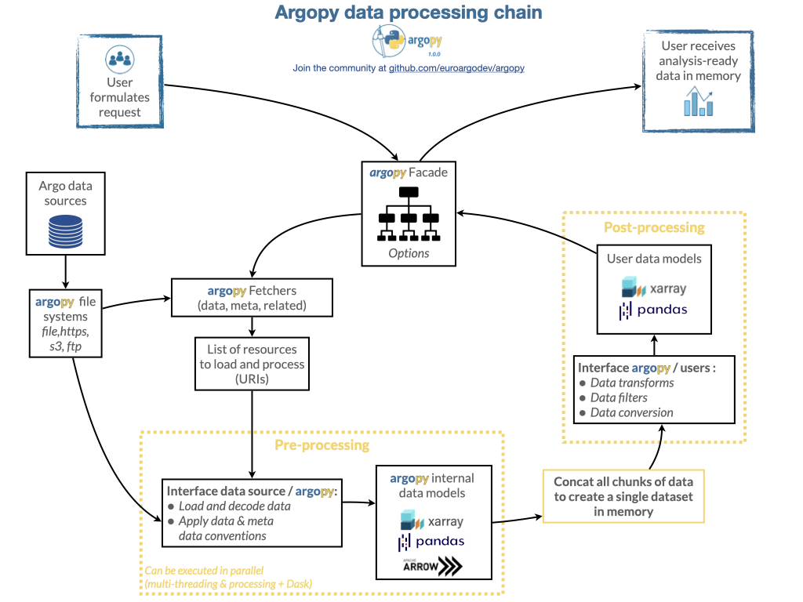

.. currentmodule:: argopy

Performances
============

Solutions
---------

To improve **argopy** data fetching performances, several solutions are available:

-  :ref:`cache` your fetched data, i.e. save your request locally so that you don’t have to fetch it again,
-  Use the :ref:`parallel` argument, i.e. fetch chunks of independent data simultaneously (e.g. to be used with a Dask cluster),
-  Load data :ref:`lazily <lazy>`.

.. toctree::
    :maxdepth: 2
    :hidden:

    caching
    parallelization
    laziness

Limitations
-----------

We identified some limitations to what can be done to improve Argo data fetching performances. Here they are !

If you feel you can tackle one of these, don't hesitate to `raise an issue <https://github.com/euroargodev/argopy/issues/new>`_ or a `discussion items <https://github.com/euroargodev/argopy/discussions/new?category=ideas>`_ on our repository.

Externals
~~~~~~~~~

In practice we have noted that when fetching data through a web API, i.e. with the ``argovis`` and ``erddap`` data sources,
fetching performances are limited by the API response time. In other word, **argopy** can't improve performances because
most of time is spent waiting for the API server to respond.

In practice as well, we have noted that when fetching data from a GDAC host, local or remote, the **GDAC folder design**
organised by DAC and floats, rather than by parameter or space/time for instance, can add a significant overhead
because data may have to be merged from a larger number of individual float files. This performance limitation by design
of the GDAC is further accentuated by the current **argopy** internal design, see below.

Internals
~~~~~~~~~

The schematic below describes how **argopy** is organized internally to handle an user request through the data fetching
facade :class:`DataFetcher`. We clearly see from this schematic that only the pre-processing component of the internal
workflow is parallelized.

