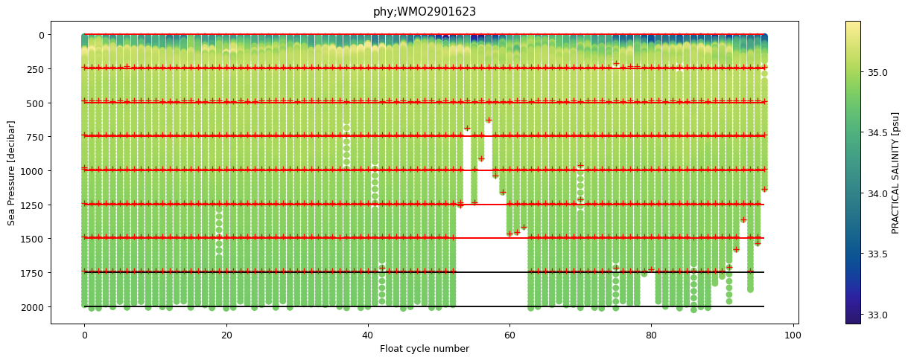
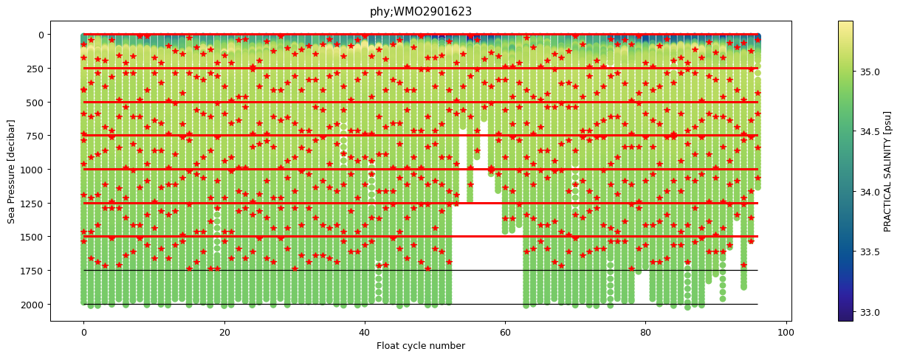

Manipulating data
=================

.. contents::
   :local:

Once you fetched data, **argopy** comes with a handy :class:`xarray.Dataset` accessor namespace ``argo`` to perform specific manipulation of the data. This means that if your dataset is `ds`, then you can use `ds.argo` to access more **argopy** functions.

.. currentmodule:: xarray

Once you fetched data, **argopy** comes with a handy :class:`xarray.Dataset` accessor ``argo`` to perform specific manipulation of the data. This means that if your dataset is named `ds`, then you can use `ds.argo` to access more **argopy** functions. The full list is available in the API documentation page :ref:`Dataset.argo (xarray accessor)`.

Let's start with standard import:

.. ipython:: python
    :okwarning:

    from argopy import DataFetcher as ArgoDataFetcher

Transformation
--------------

Points vs profiles
^^^^^^^^^^^^^^^^^^

Fetched data are returned as a 1D array collection of measurements:

.. ipython:: python
    :okwarning:

    argo_loader = ArgoDataFetcher().region([-75,-55,30.,40.,0,100., '2011-01-01', '2011-01-15'])
    ds_points = argo_loader.to_xarray()
    ds_points

If you prefer to work with a 2D array collection of vertical profiles, simply transform the dataset with :meth:`Dataset.argo.point2profile`:

.. ipython:: python
    :okwarning:

    ds_profiles = ds_points.argo.point2profile()
    ds_profiles

You can simply reverse this transformation with the :meth:`Dataset.argo.profile2point`:

.. ipython:: python
    :okwarning:

    ds = ds_profiles.argo.profile2point()
    ds

Pressure levels: Interpolation
^^^^^^^^^^^^^^^^^^^^^^^^^^^^^^

Once your dataset is a collection of vertical **profiles**, you can interpolate variables on standard pressure levels using :meth:`Dataset.argo.interp_std_levels` with your levels as input :meth:`Dataset.argo.interp_std_levels`:

.. ipython:: python
    :okwarning:

    ds_interp = ds_profiles.argo.interp_std_levels([0,10,20,30,40,50])
    ds_interp

Note on the linear interpolation process : 
    - Only profiles that have a maximum pressure higher than the highest standard level are selected for interpolation.
    - Remaining profiles must have at least five data points to allow interpolation.
    - For each profile, shallowest data point is repeated to the surface to allow a 0 standard level while avoiding extrapolation.

Pressure levels: Group-by bins
^^^^^^^^^^^^^^^^^^^^^^^^^^^^^^

If you prefer to avoid interpolation, you can opt for a pressure bins grouping reduction using :meth:`Dataset.argo.groupby_pressure_bins`. This method can be used to subsample and align an irregular dataset (pressure not being similar in all profiles) on a set of pressure bins. The output dataset could then be used to perform statistics along the N_PROF dimension because N_LEVELS will corresponds to similar pressure bins.

To illustrate this method, let's start by fetching some data from a low vertical resolution float:

.. ipython:: python
    :okwarning:

    loader = ArgoDataFetcher(src='erddap', mode='expert').float(2901623)  # Low res float
    ds = loader.load().data

Let's now sub-sample these measurements along 250db bins, selecting values from the **deepest** pressure levels for each bins:

.. ipython:: python
    :okwarning:

    bins = np.arange(0.0, np.max(ds["PRES"]), 250.0)
    ds_binned = ds.argo.groupby_pressure_bins(bins=bins, select='deep')
    ds_binned

See the new ``STD_PRES_BINS`` variable that hold the pressure bins definition.

The figure below shows the sub-sampling effect:

.. code-block:: python

    import matplotlib as mpl
    import matplotlib.pyplot as plt
    import cmocean

    fig, ax = plt.subplots(figsize=(18,6))
    ds.plot.scatter(x='CYCLE_NUMBER', y='PRES', hue='PSAL', ax=ax, cmap=cmocean.cm.haline)
    plt.plot(ds_binned['CYCLE_NUMBER'], ds_binned['PRES'], 'r+')
    plt.hlines(bins, ds['CYCLE_NUMBER'].min(), ds['CYCLE_NUMBER'].max(), color='k')
    plt.hlines(ds_binned['STD_PRES_BINS'], ds_binned['CYCLE_NUMBER'].min(), ds_binned['CYCLE_NUMBER'].max(), color='r')
    plt.title(ds.attrs['Fetched_constraints'])
    plt.gca().invert_yaxis()

The bin limits are shown with horizontal red lines, the original data are in the background colored scatter and the group-by pressure bins values are highlighted in red marks

The ``select`` option can take many different values, see the full documentation of :meth:`Dataset.argo.groupby_pressure_bins` , for all the details. Let's show here results from the ``random`` sampling:

.. code-block:: python

    ds_binned = ds.argo.groupby_pressure_bins(bins=bins, select='random')

Filters
^^^^^^^

If you fetched data with the ``expert`` mode, you may want to use *filters* to help you curate the data.

- **QC flag filter**: :meth:`Dataset.argo.filter_qc`. This method allows you to filter measurements according to QC flag values. This filter modifies all variables of the dataset.
- **Data mode filter**: :meth:`Dataset.argo.filter_data_mode`. This method allows you to filter variables according to their data mode. This filter modifies the <PARAM> and <PARAM_QC> variables of the dataset.
- **OWC variables filter**: :meth:`Dataset.argo.filter_scalib_pres`. This method allows you to filter variables according to OWC salinity calibration software requirements. This filter modifies pressure, temperature and salinity related variables of the dataset.

Complementary data
------------------

TEOS-10 variables
~~~~~~~~~~~~~~~~~

You can compute additional ocean variables from `TEOS-10 <http://teos-10.org/>`_. The default list of variables is: 'SA', 'CT', 'SIG0', 'N2', 'PV', 'PTEMP' ('SOUND_SPEED', 'CNDC' are optional). `Simply raise an issue to add a new one <https://github.com/euroargodev/argopy/issues/new/choose>`_.

This can be done using the :meth:`Dataset.argo.teos10` method and indicating the list of variables you want to compute:

.. ipython:: python
    :okwarning:

    ds = ArgoDataFetcher().float(2901623).to_xarray()
    ds.argo.teos10(['SA', 'CT', 'PV'])

.. ipython:: python
    :okwarning:

    ds['SA']

Data models
-----------

By default **argopy** works with :class:`xarray.Dataset` for Argo data fetcher, and with :class:`pandas.DataFrame` for Argo index fetcher.

For your own analysis, you may prefer to switch from one to the other. This is all built in **argopy**, with the :meth:`argopy.DataFetcher.to_dataframe` and :meth:`argopy.IndexFetcher.to_xarray` methods.

.. ipython:: python
    :okwarning:

    ArgoDataFetcher().profile(6902746, 34).to_dataframe()

Saving data
===========

Once you have your Argo data as :class:`xarray.Dataset`, simply use the awesome possibilities of `xarray <http://xarray.pydata.org>`_ like :meth:`xarray.Dataset.to_netcdf` or :meth:`xarray.Dataset.to_zarr`.
