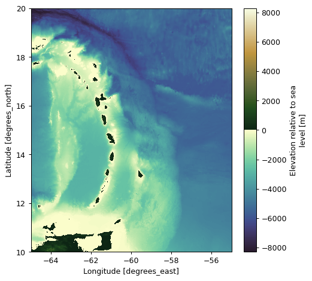

.. _data_qc:

Data quality control
====================

**argopy** comes with handy methods to help you quality control measurements. This section is probably intended for `expert` users.

Most of these methods are available through the :class:`xarray.Dataset` accessor namespace ``argo``. This means that if your dataset is `ds`, then you can use `ds.argo` to access more **argopy** functionalities.

Let's start with import and set-up:

.. ipython:: python
    :okwarning:

    from argopy import DataFetcher as ArgoDataFetcher

Topography
----------

For some QC of trajectories, it can be useful to easily get access to the topography. This can be done with the **argopy** utility class:`argopy.TopoFetcher`:

.. ipython:: python
    :okwarning:

    from argopy import TopoFetcher
    box = [-65, -55, 10, 20]
    ds = TopoFetcher(box, cache=True).to_xarray()

Combined with the fetcher property ``domain``, it now becomes easy to superimpose float trajectory with topography:

.. ipython:: python
    :okwarning:

    loader = ArgoDataFetcher().float(2901623)
    box = loader.domain[0:4]
    # box = np.array(loader.domain[0:4]) + np.array([-2, 2, -2, 2])  # for a larger box
    ds = TopoFetcher(box, cache=True).to_xarray()

.. code-block:: python

    fig, ax = loader.plot('trajectory', figsize=(10, 10))
    ds['elevation'].plot.contourf(levels=np.arange(-6000,0,200), ax=ax, add_colorbar=False)

.. image:: _static/trajectory_topography_sample.png

.. note::

The ``TopoFetcher`` can return a lower resolution topography with the ``stride`` option. See the :class:`argopy.TopoFetcher` full documentation for all the details.
