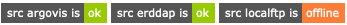

Data sources
============

|Profile count|

|Profile BGC count|

|Erddap status| |Argovis status| |Statuspage|

.. |Erddap status| image:: https://img.shields.io/endpoint?url=https://raw.githubusercontent.com/euroargodev/argopy-status/master/argopy_api_status_erddap.json
.. |Argovis status| image:: https://img.shields.io/endpoint?url=https://raw.githubusercontent.com/euroargodev/argopy-status/master/argopy_api_status_argovis.json
.. |Profile count| image:: https://img.shields.io/endpoint?label=Number%20of%20Argo%20profiles%3A&style=social&url=https%3A%2F%2Fapi.ifremer.fr%2Fargopy%2Fdata%2FARGO-FULL.json
.. |Profile BGC count| image:: https://img.shields.io/endpoint?label=Number%20of%20Argo%20BGC%20profiles%3A&style=social&url=https%3A%2F%2Fapi.ifremer.fr%2Fargopy%2Fdata%2FARGO-BGC.json
.. |Statuspage| image:: https://img.shields.io/static/v1?label=&message=Check%20all%20Argo%20monitors&color=blue&logo=statuspage&logoColor=white
   :target: https://argopy.statuspage.io

.. contents::
   :local:

Let's start with standard import:

.. ipython:: python
    :okwarning:

    import argopy
    from argopy import DataFetcher as ArgoDataFetcher

Selecting a source
------------------

**argopy** can get access to Argo data from different sources:

1. the `Ifremer erddap server <http://www.ifremer.fr/erddap>`__.

   | The erddap server database is updated daily and doesn’t require you
     to download anymore data than what you need.
   | You can select this data source with the keyword ``erddap`` and
     methods described below. The Ifremer erddap dataset is based on
     mono-profile files of the GDAC.

2. your local collection of Argo files, organised as in the `GDAC
   ftp <http://www.argodatamgt.org/Access-to-data/Argo-GDAC-ftp-and-https-servers>`__.

   | This is how you would use **argopy** with your data, as long as
     they are formatted and organised the Argo way.
   | You can select this data source with the keyword ``localftp`` and
     methods described below.

3. the `Argovis server <https://argovis.colorado.edu/>`__.

   The Argovis server database is updated daily and provides access to
   curated Argo data (QC=1 only). You can select this data source with
   the keyword ``argovis`` and methods described below.

You have several ways to specify which data source you want to use:

-  **using argopy global options**:

.. ipython:: python
    :okwarning:

    argopy.set_options(src='erddap')

-  **in a temporary context**:

.. ipython:: python
    :okwarning:

    with argopy.set_options(src='erddap'):
        loader = ArgoDataFetcher().profile(6902746, 34)

-  **with an argument in the data fetcher**:

.. ipython:: python
    :okwarning:

    loader = ArgoDataFetcher(src='erddap').profile(6902746, 34)

Setting a local copy of the GDAC ftp
------------------------------------

Data fetching with the ``localftp`` data source will require you to
specify the path toward your local copy of the GDAC ftp server with the
``local_ftp`` option.

This is not an issue for expert users, but standard users may wonder how
to set this up. The primary distribution point for Argo data, the only
one with full support from data centers and with nearly a 100% time
availability, is the GDAC ftp. Two mirror servers are available:

-  France Coriolis: ftp://ftp.ifremer.fr/ifremer/argo
-  US GODAE: ftp://usgodae.org/pub/outgoing/argo

If you want to get your own copy of the ftp server content, Ifremer
provides a nice rsync service. The rsync server “vdmzrs.ifremer.fr”
provides a synchronization service between the “dac” directory of the
GDAC and a user mirror. The “dac” index files are also available from
“argo-index”.

From the user side, the rsync service:

-  Downloads the new files
-  Downloads the updated files
-  Removes the files that have been removed from the GDAC
-  Compresses/uncompresses the files during the transfer
-  Preserves the files creation/update dates
-  Lists all the files that have been transferred (easy to use for a
   user side post-processing)

To synchronize the whole dac directory of the Argo GDAC:

.. code:: bash

   rsync -avzh --delete vdmzrs.ifremer.fr::argo/ /home/mydirectory/...

To synchronize the index:

.. code:: bash

   rsync -avzh --delete vdmzrs.ifremer.fr::argo-index/ /home/mydirectory/...

.. note::

    The first synchronisation of the whole dac directory of the Argo GDAC (365Gb) can take quite a long time (several hours).

Comparing data sources
----------------------

Features
~~~~~~~~

Each of the available data sources have their own features and
capabilities. Here is a summary:

======================= ====== ======== =======
Data source:            erddap localftp argovis
======================= ====== ======== =======
**Access Points**                       
region                  X      X        X
float                   X      X        X
profile                 X      X        X
**User mode**                           
standard                X      X        X
expert                  X      X        
**Dataset**                             
core (T/S)              X      X        X
BGC                                     
Reference data for DMQC X               
**Parallel method**                     
multi-threading         X      X        X
multi-processes                X        
Dask client                             
======================= ====== ======== =======

Fetched data and variables
~~~~~~~~~~~~~~~~~~~~~~~~~~

| You may wonder if the fetched data are different from the available
  data sources.
| This will depend on the last update of each data sources and of your
  local data.

Let's retrieve one float data from a local sample of the GDAC ftp (a sample GDAC ftp is downloaded automatically with the method :meth:`argopy.tutorial.open_dataset`):

.. ipython:: python
    :okwarning:

    # Download ftp sample and get the ftp local path:
    ftproot = argopy.tutorial.open_dataset('localftp')[0]
    
    # then fetch data:
    with argopy.set_options(src='localftp', local_ftp=ftproot):
        ds = ArgoDataFetcher().float(1900857).to_xarray()
        print(ds)

Let’s now retrieve the latest data for this float from the ``erddap`` and ``argovis`` sources:

.. ipython:: python
    :okwarning:

    with argopy.set_options(src='erddap'):
        ds = ArgoDataFetcher().float(1900857).to_xarray()
        print(ds)

.. ipython:: python
    :okwarning:

    with argopy.set_options(src='argovis'):
        ds = ArgoDataFetcher().float(1900857).to_xarray()
        print(ds)

We can see some minor differences between ``localftp``/``erddap`` vs the
``argovis`` response: this later data source does not include the
descending part of the first profile, this explains why ``argovis``
returns slightly less data.

.. _api-status:

Status of sources
-----------------

With remote, online data sources, it may happens that the data server is experiencing down time. 
With local data sources, the availability of the path is checked when it is set. But it may happens that the path points to a disk that get unmounted or unplugged after the option setting.

If you're running your analysis on a Jupyter notebook, you can use the :meth:`argopy.status` method to insert a data status monitor on a cell output. All available data sources will be monitored continuously.

.. code-block:: python

    argopy.status()

.. image:: _static/status_monitor.png
  :width: 350
  
If one of the data source become unavailable, you will see the status bar changing to something like:
  

  
Note that the :meth:`argopy.status` method has a ``refresh`` option to let you specify the refresh rate in seconds of the monitoring.

Last, you can check out `the following argopy status webpage that monitors all important resources to the software <https://argopy.statuspage.io>`_.
