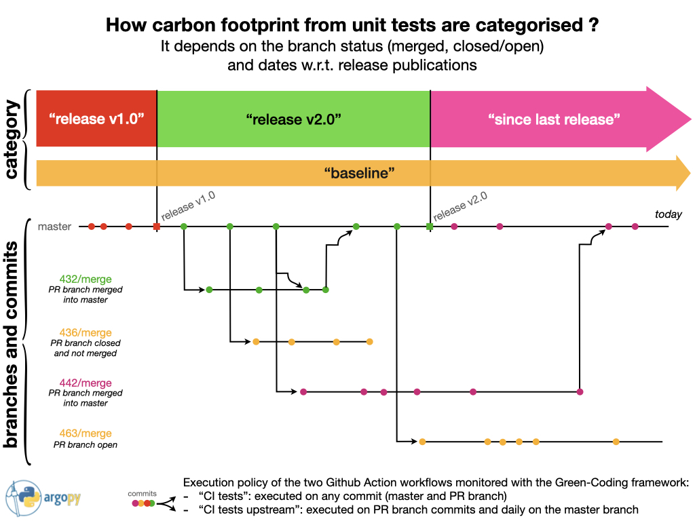

.. _energy:

Carbon emissions
================

Why
---
The **argopy** team is concerned about the environmental impact of your favorite software development activities.

Starting June 1st 2024, we're experimenting with the `Green Metrics Tools <https://metrics.green-coding.io>`_ from `Green Coding <https://www.green-coding.io>`_ to get an estimate of the energy used and CO2eq emitted by our development activities on Github infrastructure.

This experiment shall help us understand the carbon emissions of our digital activities in order to minimize it.

Results
-------

|eqco2_since_last_release|

All data are public and can be obtained with the Green Coding API or with simply the argopy :class:`argopy.utils.GreenCoding` class.

You can also check the Green-Coding Monitoring dashboards in here:

- `For CI tests running on each commit in the master branch <https://metrics.green-coding.io/ci.html?repo=euroargodev/argopy&branch=master&workflow=22344160&metric=carbon>`_

- `For upstream CI tests running daily and on each commit in the master branch <https://metrics.green-coding.io/ci.html?repo=euroargodev/argopy&branch=master&workflow=25052179&metric=carbon>`_

Note that these dashboards are for activities in the `master` branch. But all branches are monitored as well.

Branch metrics can be summed to compute each new release specific impact. We make it easy to access this information with the :class:`argopy.utils.GreenCoding` class.

.. code-block:: python
    :caption: Argopy carbon footprint metrics

    from argopy.utils import GreenCoding

    GreenCoding().measurements(branch='master', start_date='2025-01-01', end_date='2025-01-31')
    GreenCoding().total_measurements(branches=['385/merge', '437/merge'])

    GreenCoding().footprint_since_last_release()
    GreenCoding().footprint_for_release('v1.0.0')

This class is currently used in the `monitoring framework of Argo APIs in here <https://github.com/euroargodev/argopy-status?tab=readme-ov-file#energy-impact>`_.

Methodology
-----------
Our continuous integration pipeline works with Github Actions that operate on Microsoft Azure VMs. For each run, we use the `Eco-CI Energy Estimation tool <https://github.com/marketplace/actions/eco-ci-energy-estimation>`_  to monitor CPU usage. Based on the type of machine and their location, a model is used to predict the energy consumed. Then, an estimate at the machine location of the electric grid carbon impact is obtained from `Electricity Maps <https://app.electricitymaps.com>`_ and finaly a carbon footprint is obtained. This method is based on a `peer-reviewed research paper <https://www.green-coding.io/projects/cloud-energy>`_.

In argopy we furthermore categorise each Github Actions run, in order to get an easier understanding of our software development and maintenance footprint. We do it along the categorisation principle shown in figure :numref:`carbon_footprint`. The carbon footprint for each category in then easily accessible with the :class:`argopy.utils.GreenCoding` class.

.. _carbon_footprint:

    Schematic showing how each commit and corresponding workflows are categorised by the :class:`argopy.utils.GreenCoding` class.

.. |energyused_CItests| image:: https://api.green-coding.io/v1/ci/badge/get?repo=euroargodev/argopy&branch=master&workflow=22344160&mode=totals
   :target: https://metrics.green-coding.io/ci.html?repo=euroargodev/argopy&branch=master&workflow=22344160

.. |energyused_CItests_upstream| image:: https://api.green-coding.io/v1/ci/badge/get?repo=euroargodev/argopy&branch=master&workflow=25052179&mode=totals
   :target: https://metrics.green-coding.io/ci.html?repo=euroargodev/argopy&branch=master&workflow=25052179

.. |eqco2_CItests| image:: https://api.green-coding.io/v1/ci/badge/get?repo=euroargodev/argopy&branch=master&workflow=22344160&mode=totals&metric=carbon
   :target: https://metrics.green-coding.io/ci.html?repo=euroargodev/argopy&branch=master&workflow=22344160

.. |eqco2_CItests_upstream| image:: https://api.green-coding.io/v1/ci/badge/get?repo=euroargodev/argopy&branch=master&workflow=25052179&mode=totals&metric=carbon
   :target: https://metrics.green-coding.io/ci.html?repo=euroargodev/argopy&branch=master&workflow=25052179

.. |eqco2_CItests_30days| image:: https://api.green-coding.io/v1/ci/badge/get?repo=euroargodev/argopy&branch=master&workflow=22344160&mode=totals&metric=carbon&duration_days=30
   :target: https://metrics.green-coding.io/ci.html?repo=euroargodev/argopy&branch=master&workflow=22344160

.. |eqco2_CItests_upstream_30days| image:: https://api.green-coding.io/v1/ci/badge/get?repo=euroargodev/argopy&branch=master&workflow=25052179&mode=totals&metric=carbon&duration_days=30
   :target: https://metrics.green-coding.io/ci.html?repo=euroargodev/argopy&branch=master&workflow=25052179

.. |eqco2_since_last_release| image:: https://img.shields.io/endpoint?url=https://raw.githubusercontent.com/euroargodev/argopy-status/master/argopy_carbonfootprint_since_last_release.json