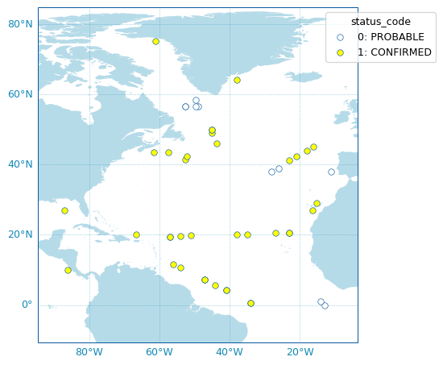

.. currentmodule:: argopy
.. _metadata_fetching:

Argo meta-data
==============

Index of profiles
-----------------
.. currentmodule:: argopy

Since the Argo measurements dataset is quite complex, it comes with a collection of index files, or lookup tables with meta data. These index help you determine what you can expect before retrieving the full set of measurements. **argopy** has a specific fetcher for index files:

.. ipython:: python
    :okwarning:

    from argopy import IndexFetcher as ArgoIndexFetcher

You can use the Index fetcher with the ``region`` or ``float`` access points, similarly to data fetching:

.. ipython:: python
    :suppress:

    import argopy
    ftproot = argopy.tutorial.open_dataset('gdac')[0]
    argopy.set_options(ftp=ftproot)

.. ipython:: python
    :okwarning:

    idx = ArgoIndexFetcher(src='gdac').float(2901623).load()
    idx.index

Alternatively, you can use :meth:`argopy.IndexFetcher.to_dataframe()`:

.. ipython:: python
    :okwarning:

    idx = ArgoIndexFetcher(src='gdac').float(2901623)
    df = idx.to_dataframe()

The difference is that with the `load` method, data are stored in memory and not fetched on every call to the `index` attribute.

The index fetcher has pretty much the same methods than the data fetchers. you can check them all here: :class:`argopy.fetchers.ArgoIndexFetcher`.

Reference tables
----------------
.. currentmodule:: argopy.utilities

The Argo netcdf format is strict and based on a collection of variables fully documented and conventioned. All reference tables can be found in the `Argo user manual <https://doi.org/10.13155/29825>`_.

However, a machine-to-machine access to these tables is often required. This is possible thanks to the work of the **Argo Vocabulary Task Team (AVTT)** that is a team of people responsible for the `NVS <https://github.com/nvs-vocabs>`_ collections under the Argo Data Management Team governance.

.. note::

    The GitHub organization hosting the AVTT is the 'NERC Vocabulary Server (NVS)', aka 'nvs-vocabs'. This holds a list of NVS collection-specific GitHub repositories. Each Argo GitHub repository is called after its corresponding collection ID (e.g. R01, RR2, R03 etc.). `The current list is given here <https://github.com/nvs-vocabs?q=argo&type=&language=&sort=name>`_.

    The management of issues related to vocabularies managed by the Argo Data Management Team is done on this `repository <https://github.com/nvs-vocabs/ArgoVocabs>`_.

**argopy** provides the utility class :class:`ArgoNVSReferenceTables` to easily fetch and get access to all Argo reference tables. If you already know the name of the reference table you want to retrieve, you can simply get it like this:

.. ipython:: python
    :okwarning:

    from argopy import ArgoNVSReferenceTables
    NVS = ArgoNVSReferenceTables()
    NVS.tbl('R01')

The reference table is returned as a :class:`pandas.DataFrame`. If you want the exact name of this table:

.. ipython:: python

    NVS.tbl_name('R01')

On the other hand, if you want to retrieve all reference tables, you can do it with the :meth:`ArgoNVSReferenceTables.all_tbl` method. It will return a dictionary with table short names as key and :class:`pandas.DataFrame` as values.

.. ipython:: python

    all = NVS.all_tbl()
    all.keys()

Deployment Plan
---------------
.. currentmodule:: argopy.utilities

It may be useful to be able to retrieve meta-data from Argo deployments. **argopy** can use the `OceanOPS API for metadata access <https://www.ocean-ops.org/api/swagger/?url=https://www.ocean-ops.org/api/1/oceanops-api.yaml>`_ to retrieve these information. The returned deployment `plan` is a list of all Argo floats ever deployed, together with their deployment location, date, WMO, program, country, float model and current status.

To fetch the Argo deployment plan, **argopy** provides a dedicated utility class: :class:`OceanOPSDeployments` that can be used like this:

.. ipython:: python
    :okwarning:

    from argopy import OceanOPSDeployments

    deployment = OceanOPSDeployments()

    df = deployment.to_dataframe()
    df

:class:`OceanOPSDeployments` can also take an index box definition as argument in order to restrict the deployment plan selection to a specific region or period:

.. code-block:: python

    deployment = OceanOPSDeployments([-90, 0, 0, 90])
    # deployment = OceanOPSDeployments([-20, 0, 42, 51, '2020-01', '2021-01'])
    # deployment = OceanOPSDeployments([-180, 180, -90, 90, '2020-01', None])

Note that if the starting date is not provided, it will be set automatically to the current date.

Last, :class:`OceanOPSDeployments` comes with a plotting method:

.. code-block:: python

    fig, ax = deployment.plot_status()

.. note:: The list of possible deployment status name/code is given by:

    .. code-block:: python

        OceanOPSDeployments().status_code

    =========== == ====
    Status      Id Description
    =========== == ====
    PROBABLE    0  Starting status for some platforms, when there is only a few metadata available, like rough deployment location and date. The platform may be deployed
    CONFIRMED   1  Automatically set when a ship is attached to the deployment information. The platform is ready to be deployed, deployment is planned
    REGISTERED  2  Starting status for most of the networks, when deployment planning is not done. The deployment is certain, and a notification has been sent via the OceanOPS system
    OPERATIONAL 6  Automatically set when the platform is emitting a pulse and observations are distributed within a certain time interval
    INACTIVE    4  The platform is not emitting a pulse since a certain time
    CLOSED      5  The platform is not emitting a pulse since a long time, it is considered as dead
    =========== == ====

