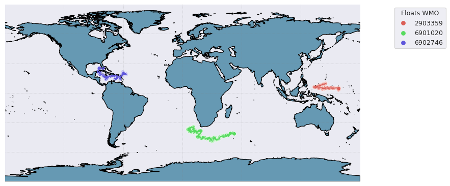

.. _data_viz:

Data visualisation
##################

Although ``argopy`` is not focus on visualisation, it provides a few functions to get you started. Plotting functions are available for both the data and index fetchers.

Trajectories from an index
--------------------------

.. code-block:: python

    from argopy import IndexFetcher as ArgoIndexFetcher
    idx = ArgoIndexFetcher().float([6902745, 6902746]).load()
    fig, ax = idx.plot('trajectory')

.. image:: _static/trajectory_sample.png

Some options are available to customise the plot, for instance:

.. code-block:: python

    from argopy import DataFetcher as ArgoDataFetcher
    idx = ArgoDataFetcher().float([6901020, 6902746, 2903359]).load()
    fig, ax = idx.plot('trajectory', style='white', palette='hls', figsize=(10,6), set_global=True)

Float dashboard
---------------

When working in Jupyter notebook, you can insert the EuroArgo dashboard in a cell with:

.. code-block:: python

    import argopy
    argopy.dashboard()

.. image:: _static/dashboard.png

and for a specific float, just provide its WMO:

.. code-block:: python

    import argopy
    argopy.dashboard(wmo=6902746)

.. image:: _static/dashboard_float.png
