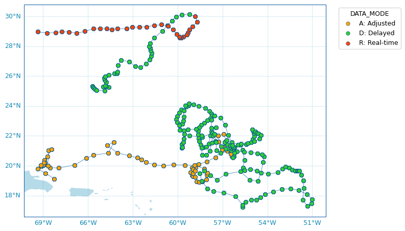

.. _data_viz:

Data visualisation
##################

From Data or Index fetchers
***************************

The :class:`argopy.DataFetcher` and :class:`argopy.IndexFetcher` come with a **plot** method to have a quick look to your data. This method can take 'trajectory', 'profiler', 'dac' and `qc_altimetry` as arguments. All details are available in the :class:`argopy.fetchers.ArgoDataFetcher.plot` and here :class:`argopy.fetchers.ArgoIndexFetcher.plot` API documentation.

Let's import the usual suspects:

.. code-block:: python

    from argopy import IndexFetcher as ArgoIndexFetcher
    from argopy import DataFetcher as ArgoDataFetcher

And demonstrate how to use the **plot** method:

Trajectories
============

.. code-block:: python

    idx = ArgoIndexFetcher().float([6902745, 6902746]).load()
    fig, ax = idx.plot('trajectory')
    fig, ax = idx.plot()  # Trajectory is the default plot

.. image:: _static/trajectory_sample.png

Some options are available to customise the plot, for instance:

.. code-block:: python

    idx = ArgoDataFetcher().float([6901020, 6902746, 2903359]).load()
    fig, ax = idx.plot('trajectory',
                       figsize=(10,6),
                       set_global=True,
                       markersize=20,
                       markeredgecolor='gray',
                       legend_title='Floats WMO',
                       cmap='Set3')

.. image:: _static/trajectory_sample_opts.png

Histograms on properties
========================

It is also possible to create horizontal bar plots for histograms on some data properties: 'profiler' and 'dac':

.. code-block:: python

    idx = ArgoIndexFetcher().region([-80,-30,20,50,'2021-01','2021-08']).load()
    fig, ax = idx.plot('dac')

.. image:: _static/bar_dac.png

.. code-block:: python

    fig, ax = idx.plot('profiler', style='whitegrid')

.. image:: _static/bar_profiler.png

Dashboards
**********

We provide a few shortcuts to third-party online dashboards that can help you visualise float or profile data.
When working in Jupyter notebooks, you can insert a dashboard in a cell, or if you don't, you can get the url toward the dashboard to open it elsewhere.

You have access to the Euro-Argo ERIC, Ocean-OPS, Argovis and BGC dashboards with the option ``type``, see :meth:`argopy.dashboard` for all the options.

Summary of available dashboards:

=================== ==== ===== =======
**Type name**       base float profile
=================== ==== ===== =======
"data", "ea"        X    X     X
"meta"              X    X     X
"bgc"               X    X     X
"ocean-ops", "op"   X    X
"coriolis", "cor"        X
"argovis"           X    X     X
=================== ==== ===== =======

Examples:

.. tabs::

    .. tab:: Default

        Open the default dashboard without arguments:

        .. code-block:: python

            argopy.dashboard()

        .. image:: _static/dashboard_data.png

    .. tab:: Float

        For a specific float, just provide its WMO:

        .. code-block:: python

            argopy.dashboard(5904797)

        .. image:: _static/dashboard_float.png

    .. tab:: Profile

        For a specific float profile, provide its WMO and cycle number:

        .. code-block:: python

            argopy.dashboard(6902746, 12)

        .. image:: _static/dashboard_profile.png

    .. tab:: BGC Profile

        one last example for a BGC float:

        .. code-block:: python

            argopy.dashboard(5903248, 3, type='bgc')

        .. image:: _static/dashboard_profile_bgc.png

.. note::

    Dashboards can be open at the package level or from data fetchers. So that we have the following equivalence::

        argopy.dashboard(WMO)
        ArgoDataFetcher().float(WMO).dashboard()

    and::

        argopy.dashboard(WMO, CYC)
        ArgoDataFetcher().profile(WMO, CYC).dashboard()

Scatter Maps
************

The :class:`argopy.plot.scatter_map` utility function is dedicated to making maps with Argo profile positions coloured according to specific variables: **a scatter map**.

Profiles colouring is finely tuned for some variables: QC flags, Data Mode and Deployment Status. By default, floats trajectories are always shown, but if the WMO is not given by a default wmo variable, it must be given as argument. The :class:`argopy.plot.scatter_map` function works with **argopy** :class:`xarray.Dataset` or :class:`pandas.DataFrame` data.

Let's import this function, the usual suspects and some data to work with:

.. code-block:: python

    from argopy.plot import scatter_map
    from argopy import DataFetcher as ArgoDataFetcher

    ArgoSet = ArgoDataFetcher(mode='expert').float([6902771, 4903348]).load()
    ds = ArgoSet.data
    df = ArgoSet.index

And see in the examples below how it can be used and tuned.

Use predefined Argo Colors
==========================
The :class:`argopy.plot.scatter_map` function uses the :class:`argopy.plot.ArgoColors` utility class to better resolve discrete colormaps of known variables. The colormap is automatically guessed using the ``hue`` argument. Here are some examples.

Parameter Data Mode
-------------------

.. code-block:: python

    scatter_map(ds, hue='DATA_MODE')
    # scatter_map(ds, hue='DATA_MODE', traj_axis='PLATFORM_NUMBER', cmap='data_mode')

QC flag
-------

.. code-block:: python

    scatter_map(ds, hue='PSAL_QC', traj_axis='PLATFORM_NUMBER')
    # scatter_map(ds, hue='PSAL_QC', traj_axis='PLATFORM_NUMBER', cmap='qc')

.. image:: _static/scatter_map_qcflag.png
