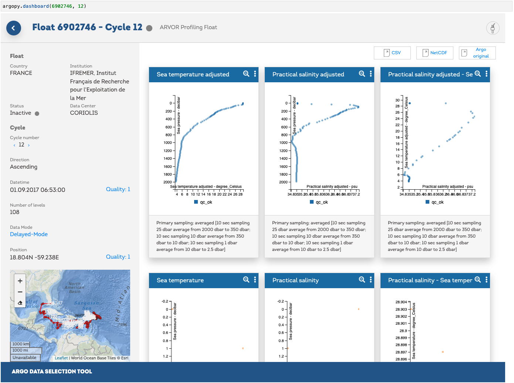

.. _data_viz:

Data visualisation
##################

Although **argopy** is not focus on visualisation, it provides a few functions to get you started. Plotting functions are available for both the data and index fetchers.

Trajectories
------------

.. code-block:: python

    from argopy import IndexFetcher as ArgoIndexFetcher
    idx = ArgoIndexFetcher().float([6902745, 6902746]).load()
    fig, ax = idx.plot('trajectory')
    fig, ax = idx.plot()  # Trajectory is the default plot

.. image:: _static/trajectory_sample.png

Some options are available to customise the plot, for instance:

.. code-block:: python

    from argopy import DataFetcher as ArgoDataFetcher
    idx = ArgoDataFetcher().float([6901020, 6902746, 2903359]).load()
    fig, ax = idx.plot('trajectory', style='white', palette='hls', figsize=(10,6), set_global=True)

.. image:: _static/trajectory_sample_white.png

Histograms on properties
------------------------

It is also possible to create bar plot for histograms on some data properties: 'profiler' and 'dac':

.. code-block:: python

    from argopy import IndexFetcher as ArgoIndexFetcher
    idx = ArgoIndexFetcher().region([-80,-30,20,50,'2021-01','2021-08']).load()
    fig, ax = idx.plot('dac')

.. image:: _static/bar_dac.png

.. code-block:: python

    fig, ax = idx.plot('profiler')

.. image:: _static/bar_profiler.png

Dashboards
----------

We provide a few shortcuts toward third-party online dashboards that can help you visualise float or profile data.
When working in Jupyter notebook, you can insert a dashboard in a cell, or get the url toward the dashboard to open it elsewhere.
You have access to the Euro-Argo ERIC, Ocean-OPS, Argovis and BGC dashboards with the option ``type``. See :meth:`argopy.dashboard` for all the options.

Open the default dashboard:

.. code-block:: python

    import argopy
    argopy.dashboard()

.. image:: _static/dashboard.png

for a specific float, just provide its WMO:

.. code-block:: python

    import argopy
    argopy.dashboard(6902746)

.. image:: _static/dashboard_float.png

or for specific float cycle:

.. code-block:: python

    import argopy
    argopy.dashboard(6902746, 12)

