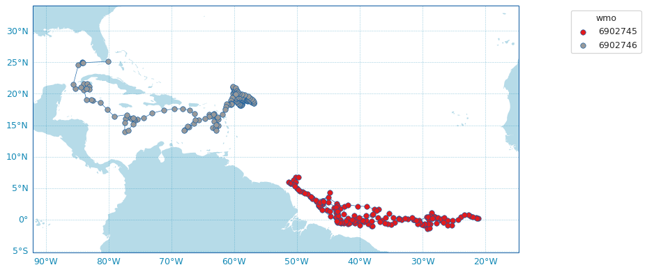

.. _data_viz:

Data visualisation
##################

Although ``argopy`` focus is not on visualisation, it provides a few functions to get you started.
A gallery of examples is in preparation for a future release.

Trajectories from an index
--------------------------

.. code-block:: python

    from argopy import IndexFetcher as ArgoIndexFetcher
    idx = ArgoIndexFetcher().float([6902745, 6902746])
    idx.to_dataframe()
    idx.plot('trajectory')

Float dashboard
---------------

When working in Jupyter notebook, you can insert the EuroArgo dashboard in a cell with:

.. code-block:: python

    import argopy
    argopy.dashboard()

.. image:: _static/dashboard.png

and for a specific float, just provide its WMO:

.. code-block:: python

    import argopy
    argopy.dashboard(wmo=6902746)

.. image:: _static/dashboard_float.png
