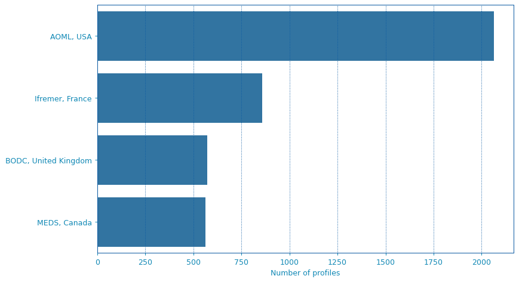
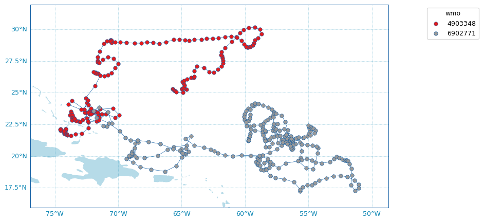

.. _data_viz:

Data visualisation
##################

.. contents::
   :local:

From Data or Index fetchers
***************************

The :class:`argopy.DataFetcher` and :class:`argopy.IndexFetcher` come with a ``plot`` method to have a quick look to your data. This method can take *trajectory*, *profiler*, *dac* and *qc_altimetry* as arguments. All details are available in the :class:`argopy.fetchers.ArgoDataFetcher.plot` and :class:`argopy.fetchers.ArgoIndexFetcher.plot` class documentation.

Below we demonstrate major plotting features.

Let's import the usual suspects:

.. code-block:: python

    from argopy import IndexFetcher as ArgoIndexFetcher
    from argopy import DataFetcher as ArgoDataFetcher

.. _viz_traj:

Trajectories
============

.. code-block:: python

    idx = ArgoIndexFetcher().float([6902745, 6902746]).load()
    fig, ax = idx.plot('trajectory')
    fig, ax = idx.plot()  # Trajectory is the default plot

.. image:: _static/trajectory_sample.png

Histograms on properties
========================

It is also possible to create horizontal bar plots for histograms on some data properties: `profiler` and `dac`:

.. code-block:: python

    idx = ArgoIndexFetcher().region([-80,-30,20,50,'2021-01','2021-08']).load()
    fig, ax = idx.plot('dac')

If you have `Seaborn <https://seaborn.pydata.org/>`_ installed, you can change the plot style:

.. code-block:: python

    fig, ax = idx.plot('profiler', style='whitegrid')

.. image:: _static/bar_profiler.png

Dashboards
**********

We provide shortcuts to third-party online dashboards that can help you visualise float or profile data.
When working in Jupyter notebooks, you can insert a dashboard in a cell, or if you don't, you can get the url toward the dashboard to open it elsewhere.

We provide access to the Euro-Argo ERIC, Ocean-OPS, Argovis and BGC dashboards with the option ``type``. See :meth:`argopy.plot.dashboard` for all the options.

Summary of all available dashboards:

=================== ==== ===== =======
**Type name**       base float profile
=================== ==== ===== =======
"data", "ea"        X    X     X
"meta"              X    X     X
"bgc"               X    X     X
"ocean-ops", "op"   X    X
"coriolis", "cor"        X
"argovis"           X    X     X
=================== ==== ===== =======

Examples:

.. tabs::

    .. tab:: Default dashboard

        Open the default dashboard like this:

        .. code-block:: python

            argopy.dashboard()

        .. image:: _static/dashboard_data.png

    .. tab:: For floats

        For a specific float, just provide its WMO:

        .. code-block:: python

            argopy.dashboard(5904797)

        .. image:: _static/dashboard_float.png

    .. tab:: For profiles

        For a specific float profile, provide its WMO and cycle number:

        .. code-block:: python

            argopy.dashboard(6902746, 12)

        .. image:: _static/dashboard_profile.png

    .. tab:: For BGC profiles

        and for a BGC float, change the ``type`` option to ``bgc``:

        .. code-block:: python

            argopy.dashboard(5903248, 3, type='bgc')

        .. image:: _static/dashboard_profile_bgc.png

.. note::

    Dashboards can be open at the package level or from data fetchers. So that we have the following equivalence::

        argopy.dashboard(WMO)
        # similar to:
        ArgoDataFetcher().float(WMO).dashboard()

    and::

        argopy.dashboard(WMO, CYC)
        # similar to:
        ArgoDataFetcher().profile(WMO, CYC).dashboard()

Scatter Maps
************

The :class:`argopy.plot.scatter_map` utility function is dedicated to making maps with Argo profile positions coloured according to specific variables: **a scatter map**.

Profiles colouring is finely tuned for some variables: QC flags, Data Mode and Deployment Status. By default, floats trajectories are always shown, but this can be changed with the ``traj`` boolean option.

Note that the :class:`argopy.plot.scatter_map` integrates seamlessly with **argopy** :ref:`Index of profiles` :class:`pandas.DataFrame` and :class:`xarray.Dataset` :ref:`collection of profiles <Points vs profiles>`. However, all default arguments can be overwritten so that it should work with other data models.

Let's import the usual suspects and some data to work with.

.. code-block:: python

    from argopy.plot import scatter_map
    from argopy import DataFetcher as ArgoDataFetcher
    from argopy import OceanOPSDeployments

    ArgoSet = ArgoDataFetcher(mode='expert').float([6902771, 4903348]).load()
    ds = ArgoSet.data.argo.point2profiles()
    df = ArgoSet.index

    df_deployment = OceanOPSDeployments([-90, 0, 0, 90]).to_dataframe()

And see in the examples below how it can be used and tuned.

Default scatter map for trajectories
====================================
By default, the :func:`argopy.plot.scatter_map` function will try to plot a trajectory map, i.e. a map where profile points are of the same color for each floats and joined by a simple line.

.. note::

    If `Cartopy <https://scitools.org.uk/cartopy/docs/latest/>`_ is installed, the :func:`argopy.plot.plot_trajectory` called by :class:`argopy.fetchers.ArgoDataFetcher.plot` and :class:`argopy.fetchers.ArgoIndexFetcher.plot` with the ``trajectory`` option will rely on the scatter map described here.

.. code-block:: python

    scatter_map(df)

Arguments can be passed explicitly as well:

.. code-block:: python

    scatter_map(df,
                x='longitude',
                y='latitude',
                hue='wmo',
                cmap='Set1',
                traj_axis='wmo')

Some options are available to customise the plot, for instance:

.. code-block:: python

    fig, ax = scatter_map(df,
                       figsize=(10,6),
                       set_global=True,
                       markersize=2,
                       markeredgecolor=None,
                       legend_title='Floats WMO',
                       cmap='Set2')

Use predefined Argo Colors
==========================
The :class:`argopy.plot.scatter_map` function uses the :class:`argopy.plot.ArgoColors` utility class to better resolve discrete colormaps of known variables. The colormap is automatically guessed using the ``hue`` argument. Here are some examples.

.. tabs::

    .. tab:: Parameter Data Mode

        Using guess mode for arguments:

        .. code-block:: python

            scatter_map(ds, hue='DATA_MODE')

        or more explicitly:

        .. code-block:: python

            scatter_map(ds,
                        x='LONGITUDE',
                        y='LATITUDE',
                        hue='DATA_MODE',
                        cmap='data_mode',
                        traj_axis='PLATFORM_NUMBER')

        .. image:: _static/scatter_map_datamode.png

    .. tab:: QC flag

        Since QC flags are given for each measurements, we need to select a specific depth levels for this plot:

        .. code-block:: python

            scatter_map(ds.isel(N_LEVELS=0), hue='PSAL_QC')

        using guess mode for arguments, or more explicitly:

        .. code-block:: python

            scatter_map(ds.isel(N_LEVELS=0),
                        x='LONGITUDE',
                        y='LATITUDE',
                        hue='PSAL_QC',
                        cmap='qc',
                        traj_axis='PLATFORM_NUMBER')

        .. image:: _static/scatter_map_qcflag.png

    .. tab:: Deployment status

        For the deployment status, there is only one point for each float, so we can make a faster plot by not using the ``traj`` option.

        .. code-block:: python

            scatter_map(df_deployment, hue='status_code', traj=False)

        .. image:: _static/scatter_map_deployment_status.png

Use any colormap
================
Beyond the predefined set of Argo colors, one can use any colormap that can be discretesized.

In the example below, we plot profile years of sampling using the reverse ``Spectral`` colormap:

.. code-block:: python

    ds['year'] = ds['TIME.year']  # Add new variable to the dataset
    scatter_map(ds.isel(N_LEVELS=0),
                hue='year',
                cmap='Spectral_r',
                legend_title='Year of sampling')

Argo colors
***********
For your own plot methods, **argopy** provides the :class:`argopy.plot.ArgoColors` utility class to better resolve discrete colormaps of known Argo variables.

The class :class:`argopy.plot.ArgoColors` is used to get a discrete colormap, as a :class:`matplotlib.colors.LinearSegmentedColormap`.

The :ref:`Use predefined Argo Colors` section above gives examples of the available colormaps that are also summarized here:

.. ipython:: python
    :suppress:

    from argopy import ArgoColors

.. tabs::

    .. tab:: Parameter Data Mode

        .. code-block:: python

            ArgoColors('data_mode')

        .. image:: _static/ArgoColors_data_mode.png

        .. ipython:: python

            ArgoColors('data_mode').definition

    .. tab:: Quality control flag scale

        .. code-block:: python

            ArgoColors('qc_flag')

        .. image:: _static/ArgoColors_qc.png

        .. ipython:: python

            ArgoColors('qc_flag').definition

    .. tab:: Deployment status

        .. code-block:: python

            ArgoColors('deployment_status')

        .. image:: _static/ArgoColors_deployment_status.png

        .. ipython:: python

            ArgoColors('deployment_status').definition

    .. tab:: Months

        .. code-block:: python

            ArgoColors('months')

        .. image:: _static/ArgoColors_months.png

        .. ipython:: python

            ArgoColors('months').definition

Note that :class:`argopy.plot.ArgoColors` can also be used to discretise any colormap:

.. code-block:: python

    ArgoColors('Blues')

.. image:: _static/ArgoColors_blues.png

.. code-block:: python

    ArgoColors('bwr', N=13)

.. image:: _static/ArgoColors_bwr.png