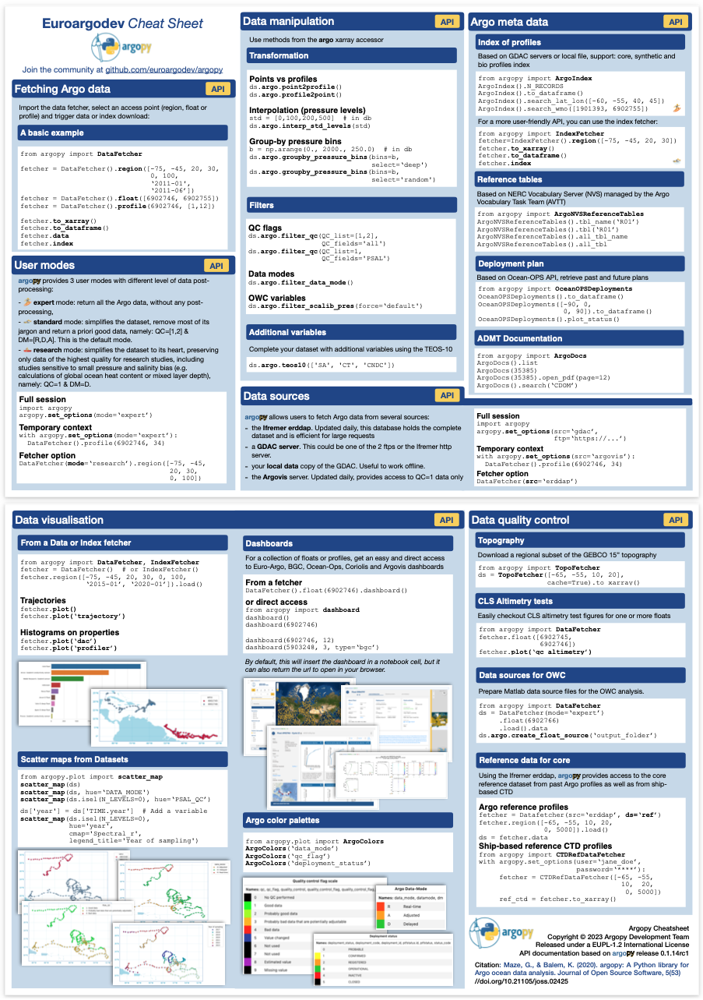

.. currentmodule:: argopy

What's New
==========

|release date| |PyPI| |Conda|

|pypi dwn| |conda dwn|

Coming up next
--------------

Features and front-end API
^^^^^^^^^^^^^^^^^^^^^^^^^^

- **Experimental new data source: AWS S3 netcdf files**. This support is primarily made available for benchmarking as part of the `ADMT working group on Argo cloud format activities <https://github.com/OneArgo/ADMT/issues/5>`_. (:pr:`385`) by |gmaze|. In order to use the experimental S3 GDAC, you can point the ``gdac`` option to the `appropriate bucket <https://registry.opendata.aws/argo-gdac-marinedata/>`_:

.. code-block:: python
    :caption: AWS S3 example

    with argopy.set_options(gdac='s3://argo-gdac-sandbox/pub'):
        ds = DataFetcher(src='gdac').float(6903091).to_xarray()

- **New** :class:`ArgoFloat` **store for Argo netcdf file load/read operation**. Whatever the Argo netcdf file location, local or remote, you can now delegate to argopy the burden of transfer protocol and GDAC paths handling. This store is primarily intended to be used by third party libraries or in workflow by operators and experts. (:pr:`429`) by |gmaze|.

Just kick in the float WMO and trigger :class:`ArgoFloat.open_dataset` !

.. code-block:: python

    from argopy import ArgoFloat
    ds = ArgoFloat(6903091).open_dataset('prof')

With more details:

.. code-block:: python

    from argopy import ArgoFloat
    WMO = 6903091

    af = ArgoFloat(WMO)  # Use argopy 'gdac' option by default
    af = ArgoFloat(WMO, host='/home/ref-argo/gdac')  # Use your local GDAC copy
    af = ArgoFloat(WMO, host='https')  # Shortcut for https://data-argo.ifremer.fr
    af = ArgoFloat(WMO, host='ftp')    # shortcut for ftp://ftp.ifremer.fr/ifremer/argo
    af = ArgoFloat(WMO, host='s3')     # Shortcut for s3://argo-gdac-sandbox/pub

    # Load any netcdf files from this float:
    ds = af.open_dataset('meta') # load <WMO>_meta.nc
    ds = af.open_dataset('prof') # load <WMO>_prof.nc
    ds = af.open_dataset('tech') # load <WMO>_tech.nc
    ds = af.open_dataset('Rtraj') # load <WMO>_Rtraj.nc

    # List all available datasets for this float:
    af.list_dataset()

- **New class** :class:`utils.ArgopyCarbon` **to compute argopy carbon footprint**. Use the Green-Coding Solutions API to retrieve energy consumption data combined with the Github API to get PR history since the last release. This class is primarily used for argopy monitoring. (:pr:`437`) by |gmaze|.

.. code-block:: python
    :caption: Argopy carbon footprint metrics

    ArgopyCarbon().workflows
    ArgopyCarbon().measurements(branch='master', start_date='2024-01-01')
    ArgopyCarbon().measurements(branch='385/merge', start_date='2024-01-01')
    ArgopyCarbon().total_measurements(branches=['master', '385/merge'])

    ArgopyCarbon().releases
    ArgopyCarbon().lastreleasedate
    ArgopyCarbon().lastPRs
    ArgopyCarbon().get_PRtitle(385)
    ArgopyCarbon().get_PRmerged_since('2025-01-01')

    ArgopyCarbon().footprint_since_last_release()

Internals
^^^^^^^^^

- **argopy file systems refactoring**. Long due internal refactoring of :ref:`File systems`. The submodule now adopt a more readable specification vs implementation design. This should not break or change high level APIs.(:pr:`425`) by |gmaze|.

- **Support Argo dataset export to zarr**. Provide preliminary support to export Argo datasets to zarr files (local or remote). (:pr:`423`) by |gmaze|.

.. code-block:: python
    :caption: Export to zarr

    from argopy import DataFetcher
    ds = DataFetcher(src='gdac').float(6903091).to_xarray()
    # then:
    ds.argo.to_zarr("6903091_prof.zarr")
    # or:
    ds.argo.to_zarr("s3://argopy/sample-data/6903091_prof.zarr")

- **Open netcdf files lazily**. We now provide low-level support for opening a netcdf Argo dataset lazily with `kerchunk <https://fsspec.github.io/kerchunk/>`_. Simply use the new option ``lazy=True`` with a :class:`stores.httpstore.open_dataset` or :class:`stores.s3store.open_dataset`. (:pr:`385`) by |gmaze|.

.. code-block:: python
    :caption: Example

    import argopy
    uri = argopy.ArgoIndex(host='s3://argo-gdac-sandbox/pub').search_wmo(6903091).uri
    ds = argopy.stores.s3store().open_dataset(uri[0], lazy=True)

.. warning::
    You will need to install the `kerchunk <https://fsspec.github.io/kerchunk/>`_ library if you don't have access to kerchunk zarr data for the netcdf files to open.

- For easy handling of lazy access to netcdf files with `kerchunk <https://fsspec.github.io/kerchunk/>`_, we introduce a :class:`stores.ArgoKerchunker` to finely tune how to handle json kerchunk data. (:pr:`385`) by |gmaze|.

.. code-block:: python
    :caption: ArgoKerchunker example

    from argopy.stores import ArgoKerchunker

    # Create an instance that will save netcdf to zarr translation data on a local folder "kerchunk_data_folder":
    ak = ArgoKerchunker(store='local', root='kerchunk_data_folder')

    # Let's take a remote Argo netcdf file from a server supporting lazy access
    # (i.e. support byte range requests):
    ncfile = "s3://argo-gdac-sandbox/pub/dac/coriolis/6903090/6903090_prof.nc"

    # Simply open the netcdf file lazily:
    # (ArgoKerchunker will handle zarr data generation and xarray syntax to use it)
    ak.open_dataset(ncfile)

- **New file system helper class for GDAC paths** :class:`stores.gdacfs`. This class allows to easily creates a file system for any of the possible GDAC paths. At this point, the class returns one of the argopy file systems (file, http, ftp or s3), but in the future, this class shall return a prefix directory file system, so that we don't have to include the GDAC path in resources to open. (:pr:`385`) by |gmaze|.

.. code-block:: python
    :caption: Example

    from argopy.stores import gdacfs
    fs = gdacfs("https://data-argo.ifremer.fr")

- Fix bug raised when the Argo reference table 8 return by the NVS server has a missing altLabel. ID of platform types are now extracted from the NVS url ID property. :issue:`420`, (:pr:`421`) by |gmaze|.

- When argopy is sending a http request to a data server, add a custom http header ``Argopy-Version`` to ease server log analysis. (:pr:`407`) by |gmaze|.

- New :meth:`ArgoIndex.copy` method (:pr:`418`) by |gmaze|. This copy allows for a:

  - deep copy, i.e. a new instance with same parameters (e.g. ``index_file``) and cleared search,
  - shallow copy, i.e. a new instance with same parameters and search results if any.

- Fix bug raising an error for ``STATION_PARAMETERS`` with a blank entry, with ``bgc`` dataset and ``gdac`` data source (well spotted |quai20|). (:pr:`418`) by |gmaze|.

- Fix bug raising an error when exporting a dataset to netcdf after erddap fetch, :issue:`412`. (:pr:`413`) by |gmaze|.

v1.0.0 (16 Oct. 2024)
---------------------

.. versionadded:: v1.0.0

    The team proudly assumes that **argopy** is all grown up !

    This version comes with improved performances and support for the BGC-Argo dataset.
    But since this is a major, we also introduces breaking changes and significant internal refactoring possibly with un-expected side effects ! So don't hesitate to `report issues on the source code repository <https://github.com/euroargodev/argopy/issues>`_.
	
.. _v1.0.0-features:

Features and front-end API
^^^^^^^^^^^^^^^^^^^^^^^^^^

- **Support for AWS S3 data files**. This support is experimental and is primarily made available for benchmarking as part of the `ADMT working group on Argo cloud format activities <https://github.com/OneArgo/ADMT/issues/5>`_.

.. currentmodule:: xarray

- **Improved support for BGC**
    - **argopy now support `standard` and `research` user modes** with the `bgc` dataset. These new user modes follows the last available ADMT recommendations to bring users a finely tuned set of BGC parameters. Details of the BGC data processing chain for each user modes can be found in the :ref:`user-mode-definition` section.

    - **Predict nutrients and carbonates in the Mediterranean Sea** with the new BGC method :class:`Dataset.argo.canyon_med`. The new method allows to make predictions of the water-Column nutrient concentrations and carbonate system variables in the Mediterranean Sea with the CANYON-MED model. This model can be used to predict PO4, NO3, DIC, SiOH4, AT and pHT. (:pr:`364`) by |gmaze|.

    .. currentmodule:: argopy

    .. code-block:: python

        from argopy import DataFetcher
        ArgoSet = DataFetcher(ds='bgc', mode='standard', params='DOXY', measured='DOXY').float(1902605)
        ds = ArgoSet.to_xarray()

        ds.argo.canyon_med.predict()
        ds.argo.canyon_med.predict('PO4')

    - **More BGC expert features** with support for the *auxiliary* index file with :class:`argopy.ArgoIndex`. Simply use the keyword `aux`. (:pr:`356`) by |gmaze|.

    .. code-block:: python

        from argopy import ArgoIndex
        ArgoIndex(index_file="aux").load()

- **More scalable data fetching using multi-processing or a Dask Cluster**.

It is now possible to use multi-processing with all data fetchers and even possibly a Dask client object. This is set with the ``parallel`` option. In doing so, the Argo data pre-processing steps (download and conformation to internal conventions) will be distributed to all available resources, significantly improving performances for fetching large selection of Argo data. (:pr:`392`) by |gmaze|.

Check the documentation on :ref:`Parallelization methods` for all the details.

.. currentmodule:: argopy

.. code-block:: python

    from dask.distributed import Client
    client = Client(processes=True)

    from argopy import DataFetcher
    DataFetcher(parallel=client, src='argovis').region([-75, -65, 25, 40, 0, 250, '2020-01-01', '2021-01-01']).to_xarray()

.. currentmodule:: xarray

- **Xarray argo accessor extensions mechanism**.

This should allows users to easily develop their own Argo dataset methods. This is possible thanks to a new class decorator :class:`argopy.extensions.register_argo_accessor` that allows to register a class as a property to the :class:`Dataset.argo` accessor. (:pr:`364`) by |gmaze|.

Example:

.. code-block:: python

    @register_argo_accessor('floats')
    class WorkWithWMO(ArgoAccessorExtension):
        """Example of a new Argo dataset feature"""

        def __init__(self, *args, **kwargs):
            super().__init__(*args, **kwargs)
            self._uid = argopy.utils.to_list(np.unique(self._obj["PLATFORM_NUMBER"].values))

        @property
        def wmo(self):
            return self._uid

        @property
        def N(self):
             return len(self.wmo)

This makes syntax like this possible:

.. code-block:: python

    ds.argo.floats.N
    ds.argo.floats.wmo

.. currentmodule:: argopy

.. _v1.0.0-breaking:

Breaking changes
^^^^^^^^^^^^^^^^

.. currentmodule:: xarray

- In the :class:`Dataset.argo` accessor (:pr:`356`) by |gmaze|:
    - the :meth:`Dataset.argo.filter_data_mode` has been deprecated and replaced by :meth:`Dataset.argo.datamode.merge` method. To actually implement a real filter of data points on data mode values, i.e. to keep points with specific data mode values, use the :meth:`Dataset.argo.datamode.filter` method.

.. currentmodule:: argopy

- The option name "ftp" is now renamed "gdac" (:pr:`389`) by |gmaze|.

- The option name "dataset" is now renamed "ds" (:pr:`389`) by |gmaze|.

- It is highly probable that more changes in this major v1.0.0 lead to breaking changes not listed here. Don't hesitate to `report them on the repository issue section <https://github.com/euroargodev/argopy/issues>`_. 

v0.1.17 (20 Sep. 2024)
----------------------

.. admonition:: This is the last minor version release

    We're very happy to announce that this v0.1.17 is the last of the minor version releases. Its main role is to introduce deprecation warnings before things break in the major version release.

    Comping up soon by the end of October the first **major argopy release: v1.0.0**

.. important:: List of deprecations before the upcoming major release v1.0.0. (:pr:`389`) by |gmaze|.

    .. currentmodule:: xarray

    - Change of signature and action with xarray Argo accessor :meth:`Dataset.argo.filter_data_mode`

    .. currentmodule:: argopy

    - Refactor option "dataset" into "ds", see :class:`argopy.set_options`
    - Refactor option "ftp" into "gdac", see :class:`argopy.set_options`

.. _v0.1.17-internals:

Internals
^^^^^^^^^

- Refactor Argovis CI tests to use mocked http server (:pr:`383`) by |gmaze|

- Improve error and warning messages from mocked http server to address :issue:`381` (:pr:`382`) by |gmaze|

.. _v0.1.17-energy:

Energy
^^^^^^

Considering `energy used by CI tests <https://argopy.readthedocs.io/en/latest/energy.html>`_, this release has required about 75.4kJ of energy to produce 6h11s39 of computation time.

v0.1.16 (27 Aug. 2024)
----------------------

.. _v0.1.16-features:

Features and front-end API
^^^^^^^^^^^^^^^^^^^^^^^^^^

- **Support for AWS S3 index files**. This support is experimental and is primarily made available for benchmarking as part of the `ADMT working group on Argo cloud format activities <https://github.com/OneArgo/ADMT/issues/5>`_. The `ADMT working group discussion items are listed here <https://github.com/OneArgo/ADMT/discussions/categories/wg-on-best-format-to-serve-argo-data-from-the-cloud>`_. Both CORE and BGC index files are supported. The new :class:`ArgoIndex` not only support access to the AWS S3 index files but also implement improved performances for search methods on WMO and cycle numbers, using :class:`boto3.client.select_object_content` SQL queries. Indeed, the ``https`` and ``ftp`` default GDAC server index files are downloaded and loaded in memory before being searched. But with ``s3``, index files can directly be queried on the server using SQL syntax; the full index is not necessarily downloaded. (:pr:`326`) by |gmaze|

.. code-block:: python

    from argopy import ArgoIndex
    idx = ArgoIndex(host='s3')  # you can also use 'aws' as a keyword for 's3://argo-gdac-sandbox/pub/idx'

    # Optimised perf with boto3.client.select_object_content queries for WMO and cycle numbers:
    idx.search_wmo(6903091)
    idx.search_cyc(12)
    idx.search_wmo_cyc(6903091, 23)

    # Other search methods will trigger download of the index file, eg:
    idx.search_tim([-60, -55, 40., 45., '2007-08-01', '2007-09-01'])

- **argovis** data source now support the new `API server <https://argovis-api.colorado.edu/docs>`_. This upgrade comes with a new option to define the optional API KEY to use. You can `get a free key here <https://argovis-keygen.colorado.edu/>`_. (:pr:`371`) by `Bill Katie-Anne Mills <https://github.com/bkatiemills>`_.

- **argopy** is concerned about its environmental impact and we'd like to understand and optimize the carbon emissions of our digital activities. Starting June 1st 2024, we use `Green Coding <https://www.green-coding.io>`_ tools to assess energy consumption and CO2eq emissions from our activities on Github infrastructure. All results and data are available on the new dedicated web page: :ref:`Carbon emissions`. (:pr:`354`) by |gmaze|.

.. _v0.1.16-internals:

Internals
^^^^^^^^^

- Drop support for Python 3.8, add support for Python 3.10. (:pr:`379`) by |gmaze|

- Update :class:`argopy.ArgoNVSReferenceTables` to handle new NVS server output format. (:pr:`378`) by |gmaze|.

- Update Ifremer erddap server information. The Argo reference for DMQC (returned by the :class:`DataFetcher` fetcher with ``ds='ref'`` argument ) and Argo CTD-reference for DQMC (returned by the :class:`CTDRefDataFetcher` fetcher) now indicate the dataset version used. (:pr:`344`) by |gmaze|.

- Pin upper bound on xarray < 2024.3 to fix failing upstream tests because of ``AttributeError: 'ScipyArrayWrapper' object has no attribute 'oindex'``, `reported here <https://github.com/pydata/xarray/issues/8909>`_. (:pr:`326`) by |gmaze|

- Fix :class:`argopy.ArgoDocs` that was not working with new Archimer webpage design, :issue:`351`. (:pr:`352`) by |gmaze|.

- Fix bug with ArgoIndex cache, :issue:`345`. (:pr:`346`) by |gmaze|.

- Keep dependencies up to date. (:pr:`333`, :pr:`337`) by |gmaze|.

- Update :class:`argopy.ArgoDocs` with last BGC cookbooks on pH. (:pr:`321`) by |gmaze|.

- Fix for fsspec > 2023.10.0. (:pr:`318`) by |gmaze|.

.. _v0.1.16-breaking:

Breaking changes
^^^^^^^^^^^^^^^^

- Drop support for erddapy < v0.8.0 (:pr:`344`) by |gmaze|.

v0.1.15 (12 Dec. 2023)
----------------------

Internals
^^^^^^^^^

- Fix bug whereby user name could not be retrieved using :func:`getpass.getuser`. This closes :issue:`310` and allows argopy to be integrated into the EU Galaxy tools for `ecology <https://github.com/galaxyecology/tools-ecology/pull/81>`_. (:pr:`311`) by |gmaze|.

v0.1.14 (29 Sep. 2023)
----------------------

.. versionadded:: v0.1.14

    This new release brings to pip and conda default install of argopy all new features introduced in the release candidate v0.1.14rc2 and v0.1.14rc1. For simplicity we merged all novelties to this v0.1.14 changelog.

Features and front-end API
^^^^^^^^^^^^^^^^^^^^^^^^^^

- **argopy now support BGC dataset in `expert` user mode for the `erddap` data source**. The BGC-Argo content of synthetic multi-profile files is now available from the Ifremer erddap. Like for the core dataset, you can fetch data for a region, float(s) or profile(s). One novelty with regard to core, is that you can restrict data fetching to some parameters and furthermore impose no-NaNs on some of these parameters. Check out the new documentation page for :ref:`data-set`. (:pr:`278`) by |gmaze|

.. code-block:: python

    import argopy
    from argopy import DataFetcher

    argopy.set_options(src='erddap', mode='expert')

    DataFetcher(ds='bgc')  # All variables found in the access point will be returned
    DataFetcher(ds='bgc', params='all')  # Default: All variables found in the access point will be returned
    DataFetcher(ds='bgc', params='DOXY') # Only the DOXY variable will be returned
    DataFetcher(ds='bgc', params=['DOXY', 'BBP700']) # Only DOXY and BBP700 will be returned

    DataFetcher(ds='bgc', measured=None)  # Default: all params are allowed to have NaNs
    DataFetcher(ds='bgc', measured='all')  # All params found in the access point cannot be NaNs
    DataFetcher(ds='bgc', measured='DOXY') # Only DOXY cannot be NaNs
    DataFetcher(ds='bgc', measured=['DOXY', 'BBP700']) # Only DOXY and BBP700 cannot be NaNs

    DataFetcher(ds='bgc', params='all', measured=None)  # Return the largest possible dataset
    DataFetcher(ds='bgc', params='all', measured='all')  # Return the smallest possible dataset
    DataFetcher(ds='bgc', params='all', measured=['DOXY', 'BBP700'])  # Return all possible params for points where DOXY and BBP700 are not NaN

- **New methods in the ArgoIndex for BGC**. The :class:`ArgoIndex` has now full support for the BGC profile index files, both bio and synthetic index. In particular it is possible to search for profiles with specific data modes on parameters. (:pr:`278`) by |gmaze|

.. code-block:: python

    from argopy import ArgoIndex

    idx = ArgoIndex(index_file="bgc-b")  # Use keywords instead of exact file names: `core`, `bgc-b`, `bgc-s`
    idx.search_params(['C1PHASE_DOXY', 'DOWNWELLING_PAR'])  # Search for profiles with parameters
    idx.search_parameter_data_mode({'TEMP': 'D'})  # Search for profiles with specific data modes
    idx.search_parameter_data_mode({'BBP700': 'D'})
    idx.search_parameter_data_mode({'DOXY': ['R', 'A']})
    idx.search_parameter_data_mode({'DOXY': 'D', 'CDOM': 'D'}, logical='or')

- **New xarray argo accessor features**. Easily retrieve an Argo sample index and domain extent with the ``index`` and ``domain`` properties. Get a list with all possible (PLATFORM_NUMBER, CYCLE_NUMBER) with the ``list_WMO_CYC`` method. (:pr:`278`) by |gmaze|

- **New search methods for Argo reference tables**. It is now possible to search for a string in tables title and/or description using the :meth:`related.ArgoNVSReferenceTables.search` method.

.. code-block:: python

    from argopy import ArgoNVSReferenceTables

    id_list = ArgoNVSReferenceTables().search('sensor')

- **Updated documentation**. In order to better introduce new features, we updated the documentation structure and content.

- **argopy** cheatsheet ! Get most of the argopy API in a 2 pages pdf !

- **Our internal Argo index store is promoted as a frontend feature**. The :class:`IndexFetcher` is a user-friendly **fetcher** built on top of our internal Argo index file store. But if you are familiar with Argo index files and/or cares about performances, you may be interested in using directly the Argo index **store**. We thus decided to promote this internal feature as a frontend class :class:`ArgoIndex`. See :ref:`Store: Low-level Argo Index access`. (:pr:`270`) by |gmaze|

- **Easy access to all Argo manuals from the ADMT**. More than 20 pdf manuals have been produced by the Argo Data Management Team. Using the new :class:`ArgoDocs` class, it's now easier to navigate this great database for Argo experts. All details in :ref:`ADMT Documentation`. (:pr:`268`) by |gmaze|

.. code-block:: python

    from argopy import ArgoDocs

    ArgoDocs().list

    ArgoDocs(35385)
    ArgoDocs(35385).ris
    ArgoDocs(35385).abstract
    ArgoDocs(35385).show()
    ArgoDocs(35385).open_pdf()
    ArgoDocs(35385).open_pdf(page=12)

    ArgoDocs().search("CDOM")

- **New 'research' user mode**. This new feature implements automatic filtering of Argo data following international recommendations for research/climate studies. With this user mode, only Delayed Mode with good QC data are returned. Check out the :ref:`user-mode-definition` section for all the details. (:pr:`265`) by |gmaze|

- **argopy now provides a specific xarray engine to properly read Argo netcdf files**. Using ``engine='argo'`` in :func:`xarray.open_dataset`, all variables will properly be casted, i.e. returned with their expected data types, which is not the case otherwise. This works with *ALL* Argo netcdf file types (as listed in the `Reference table R01 <http://vocab.nerc.ac.uk/collection/R01/current/>`_). Some details in here: :class:`argopy.xarray.ArgoEngine` (:pr:`208`) by |gmaze|

.. code-block:: python

    import xarray as xr
    ds = xr.open_dataset("dac/aoml/1901393/1901393_prof.nc", engine='argo')

- **argopy now can provide authenticated access to the Argo CTD reference database for DMQC**. Using user/password new **argopy** options, it is possible to fetch the `Argo CTD reference database <http://www.argodatamgt.org/DMQC/Reference-data-base/Latest-Argo-Reference-DB>`_, with the :class:`CTDRefDataFetcher` class. (:pr:`256`) by |gmaze|

.. code-block:: python

    from argopy import CTDRefDataFetcher

    with argopy.set_options(user="john_doe", password="***"):
        f = CTDRefDataFetcher(box=[15, 30, -70, -60, 0, 5000.0])
        ds = f.to_xarray()

.. warning::
    **argopy** is ready but the Argo CTD reference database for DMQC is not fully published on the Ifremer ERDDAP yet. This new feature will thus be fully operational soon, and while it's not, **argopy** should raise an ``ErddapHTTPNotFound`` error when using the new fetcher.

- New option to control the expiration time of cache file: ``cache_expiration``.

Internals
^^^^^^^^^

- Utilities refactoring. All classes and functions have been refactored to more appropriate locations like ``argopy.utils`` or ``argopy.related``. A deprecation warning message should be displayed every time utilities are being used from the deprecated locations. (:pr:`290`) by |gmaze|

- Fix bugs due to fsspec new internal cache handling and Windows specifics. (:pr:`293`) by |gmaze|

- New utility class :class:`utils.MonitoredThreadPoolExecutor` to handle parallelization with a multi-threading Pool that provide a notebook or terminal computation progress dashboard. This class is used by the httpstore open_mfdataset method for erddap requests.

- New utilities to handle a collection of datasets: :func:`utils.drop_variables_not_in_all_datasets` will drop variables that are not in all datasets (the lowest common denominator) and :func:`utils.fill_variables_not_in_all_datasets` will add empty variables to dataset so that all the collection have the same data_vars and coords. These functions are used by stores to concat/merge a collection of datasets (chunks).

- :func:`related.load_dict` now relies on :class:`ArgoNVSReferenceTables` instead of static pickle files.

- :class:`argopy.ArgoColors` colormap for Argo Data-Mode has now a fourth value to account for a white space FillValue.

- New quick and dirty plot method :func:`plot.scatter_plot`

- Refactor pickle files in argopy/assets as json files in argopy/static/assets

- Refactor list of variables by data types used in :func:`related.cast_Argo_variable_type` into assets json files in argopy/static/assets

- Change of behaviour: when setting the cachedir option, path it's not tested for existence but for being writable, and is created if doesn't exists (but seems to break CI upstream in Windows)

- And misc. bug and warning fixes all over the code.

- Update new argovis dashboard links for floats and profiles. (:pr:`271`) by |gmaze|

- **Index store can now export search results to standard Argo index file format**. See all details in :ref:`Store: Low-level Argo Index access`. (:pr:`260`) by |gmaze|

.. code-block:: python

    from argopy import ArgoIndex as indexstore
    # or:
    # from argopy.stores import indexstore_pd as indexstore
    # or:
    # from argopy.stores import indexstore_pa as indexstore

    idx = indexstore().search_wmo(3902131)  # Perform any search
    idx.to_indexfile('short_index.txt')  # export search results as standard Argo index csv file

- **Index store can now load/search the Argo Bio and Synthetic profile index files**. Simply gives the name of the Bio or Synthetic Profile index file and retrieve the full index. This  store also comes with a new search criteria for BGC: by parameters. See all details in :ref:`Store: Low-level Argo Index access`.  (:pr:`261`) by |gmaze|

.. code-block:: python

    from argopy import ArgoIndex as indexstore
    # or:
    # from argopy.stores import indexstore_pd as indexstore
    # or:
    # from argopy.stores import indexstore_pa as indexstore

    idx = indexstore(index_file="argo_bio-profile_index.txt").load()
    idx.search_params(['C1PHASE_DOXY', 'DOWNWELLING_PAR'])

- Use a mocked server for all http and GDAC ftp requests in CI tests (:pr:`249`, :pr:`252`, :pr:`255`) by |gmaze|
- Removed support for minimal dependency requirements and for python 3.7. (:pr:`252`) by |gmaze|
- Changed License from Apache to `EUPL 1.2 <https://opensource.org/license/eupl-1-2>`_

Breaking changes
^^^^^^^^^^^^^^^^

- Some documentation pages may have moved to new urls.

- The legacy index store is deprecated, now available in argopy.stores.argo_index_deprec.py only (:pr:`270`) by |gmaze|

v0.1.14rc2 (27 Jul. 2023)
-------------------------

Features and front-end API
^^^^^^^^^^^^^^^^^^^^^^^^^^

- **argopy now support BGC dataset in `expert` user mode for the `erddap` data source**. The BGC-Argo content of synthetic multi-profile files is now available from the Ifremer erddap. Like for the core dataset, you can fetch data for a region, float(s) or profile(s). One novelty with regard to core, is that you can restrict data fetching to some parameters and furthermore impose no-NaNs on some of these parameters. Check out the new documentation page for :ref:`data-set`. (:pr:`278`) by |gmaze|

.. code-block:: python

    import argopy
    from argopy import DataFetcher

    argopy.set_options(src='erddap', mode='expert')

    DataFetcher(ds='bgc')  # All variables found in the access point will be returned
    DataFetcher(ds='bgc', params='all')  # Default: All variables found in the access point will be returned
    DataFetcher(ds='bgc', params='DOXY') # Only the DOXY variable will be returned
    DataFetcher(ds='bgc', params=['DOXY', 'BBP700']) # Only DOXY and BBP700 will be returned

    DataFetcher(ds='bgc', measured=None)  # Default: all params are allowed to have NaNs
    DataFetcher(ds='bgc', measured='all')  # All params found in the access point cannot be NaNs
    DataFetcher(ds='bgc', measured='DOXY') # Only DOXY cannot be NaNs
    DataFetcher(ds='bgc', measured=['DOXY', 'BBP700']) # Only DOXY and BBP700 cannot be NaNs

    DataFetcher(ds='bgc', params='all', measured=None)  # Return the largest possible dataset
    DataFetcher(ds='bgc', params='all', measured='all')  # Return the smallest possible dataset
    DataFetcher(ds='bgc', params='all', measured=['DOXY', 'BBP700'])  # Return all possible params for points where DOXY and BBP700 are not NaN

- **New methods in the ArgoIndex for BGC**. The :class:`ArgoIndex` has now full support for the BGC profile index files, both bio and synthetic index. In particular it is possible to search for profiles with specific data modes on parameters. (:pr:`278`) by |gmaze|

.. code-block:: python

    from argopy import ArgoIndex

    idx = ArgoIndex(index_file="bgc-b")  # Use keywords instead of exact file names: `core`, `bgc-b`, `bgc-s`
    idx.search_params(['C1PHASE_DOXY', 'DOWNWELLING_PAR'])  # Search for profiles with parameters
    idx.search_parameter_data_mode({'TEMP': 'D'})  # Search for profiles with specific data modes
    idx.search_parameter_data_mode({'BBP700': 'D'})
    idx.search_parameter_data_mode({'DOXY': ['R', 'A']})
    idx.search_parameter_data_mode({'DOXY': 'D', 'CDOM': 'D'}, logical='or')

- **New xarray argo accessor features**. Easily retrieve an Argo sample index and domain extent with the ``index`` and ``domain`` properties. Get a list with all possible (PLATFORM_NUMBER, CYCLE_NUMBER) with the ``list_WMO_CYC`` method. (:pr:`278`) by |gmaze|

- **New search methods for Argo reference tables**. It is now possible to search for a string in tables title and/or description using the :meth:`related.ArgoNVSReferenceTables.search` method.

.. code-block:: python

    from argopy import ArgoNVSReferenceTables

    id_list = ArgoNVSReferenceTables().search('sensor')

- **Updated documentation**. In order to better introduce new features, we updated the documentation structure and content.

Internals
^^^^^^^^^

- New utility class :class:`utils.MonitoredThreadPoolExecutor` to handle parallelization with a multi-threading Pool that provide a notebook or terminal computation progress dashboard. This class is used by the httpstore open_mfdataset method for erddap requests.

- New utilities to handle a collection of datasets: :func:`utils.drop_variables_not_in_all_datasets` will drop variables that are not in all datasets (the lowest common denominator) and :func:`utils.fill_variables_not_in_all_datasets` will add empty variables to dataset so that all the collection have the same data_vars and coords. These functions are used by stores to concat/merge a collection of datasets (chunks).

- :func:`related.load_dict` now relies on :class:`ArgoNVSReferenceTables` instead of static pickle files.

- :class:`argopy.ArgoColors` colormap for Argo Data-Mode has now a fourth value to account for a white space FillValue.

- New quick and dirty plot method :func:`plot.scatter_plot`

- Refactor pickle files in argopy/assets as json files in argopy/static/assets

- Refactor list of variables by data types used in :func:`related.cast_Argo_variable_type` into assets json files in argopy/static/assets

- Change of behaviour: when setting the cachedir option, path it's not tested for existence but for being writable, and is created if doesn't exists (but seems to break CI upstream in Windows)

- And misc. bug and warning fixes all over the code.

Breaking changes
^^^^^^^^^^^^^^^^

- Some documentation pages may have moved to new urls.

v0.1.14rc1 (31 May 2023)
------------------------

Features and front-end API
^^^^^^^^^^^^^^^^^^^^^^^^^^

- **argopy** cheatsheet ! Get most of the argopy API in a 2 pages pdf !

- **Our internal Argo index store is promoted as a frontend feature**. The :class:`IndexFetcher` is a user-friendly **fetcher** built on top of our internal Argo index file store. But if you are familiar with Argo index files and/or cares about performances, you may be interested in using directly the Argo index **store**. We thus decided to promote this internal feature as a frontend class :class:`ArgoIndex`. See :ref:`Store: Low-level Argo Index access`. (:pr:`270`) by |gmaze|

- **Easy access to all Argo manuals from the ADMT**. More than 20 pdf manuals have been produced by the Argo Data Management Team. Using the new :class:`ArgoDocs` class, it's now easier to navigate this great database for Argo experts. All details in :ref:`ADMT Documentation`. (:pr:`268`) by |gmaze|

.. code-block:: python

    from argopy import ArgoDocs

    ArgoDocs().list

    ArgoDocs(35385)
    ArgoDocs(35385).ris
    ArgoDocs(35385).abstract
    ArgoDocs(35385).show()
    ArgoDocs(35385).open_pdf()
    ArgoDocs(35385).open_pdf(page=12)

    ArgoDocs().search("CDOM")

- **New 'research' user mode**. This new feature implements automatic filtering of Argo data following international recommendations for research/climate studies. With this user mode, only Delayed Mode with good QC data are returned. Check out the :ref:`user-mode-definition` section for all the details. (:pr:`265`) by |gmaze|

- **argopy now provides a specific xarray engine to properly read Argo netcdf files**. Using ``engine='argo'`` in :func:`xarray.open_dataset`, all variables will properly be casted, i.e. returned with their expected data types, which is not the case otherwise. This works with *ALL* Argo netcdf file types (as listed in the `Reference table R01 <http://vocab.nerc.ac.uk/collection/R01/current/>`_). Some details in here: :class:`argopy.xarray.ArgoEngine` (:pr:`208`) by |gmaze|

.. code-block:: python

    import xarray as xr
    ds = xr.open_dataset("dac/aoml/1901393/1901393_prof.nc", engine='argo')

- **argopy now can provide authenticated access to the Argo CTD reference database for DMQC**. Using user/password new **argopy** options, it is possible to fetch the `Argo CTD reference database <http://www.argodatamgt.org/DMQC/Reference-data-base/Latest-Argo-Reference-DB>`_, with the :class:`CTDRefDataFetcher` class. (:pr:`256`) by |gmaze|

.. code-block:: python

    from argopy import CTDRefDataFetcher

    with argopy.set_options(user="john_doe", password="***"):
        f = CTDRefDataFetcher(box=[15, 30, -70, -60, 0, 5000.0])
        ds = f.to_xarray()

.. warning::
    **argopy** is ready but the Argo CTD reference database for DMQC is not fully published on the Ifremer ERDDAP yet. This new feature will thus be fully operational soon, and while it's not, **argopy** should raise an ``ErddapHTTPNotFound`` error when using the new fetcher.

- New option to control the expiration time of cache file: ``cache_expiration``.

Internals
^^^^^^^^^

- Update new argovis dashboard links for floats and profiles. (:pr:`271`) by |gmaze|

- **Index store can now export search results to standard Argo index file format**. See all details in :ref:`Store: Low-level Argo Index access`. (:pr:`260`) by |gmaze|

.. code-block:: python

    from argopy import ArgoIndex as indexstore
    # or:
    # from argopy.stores import indexstore_pd as indexstore
    # or:
    # from argopy.stores import indexstore_pa as indexstore

    idx = indexstore().search_wmo(3902131)  # Perform any search
    idx.to_indexfile('short_index.txt')  # export search results as standard Argo index csv file

- **Index store can now load/search the Argo Bio and Synthetic profile index files**. Simply gives the name of the Bio or Synthetic Profile index file and retrieve the full index. This  store also comes with a new search criteria for BGC: by parameters. See all details in :ref:`Store: Low-level Argo Index access`.  (:pr:`261`) by |gmaze|

.. code-block:: python

    from argopy import ArgoIndex as indexstore
    # or:
    # from argopy.stores import indexstore_pd as indexstore
    # or:
    # from argopy.stores import indexstore_pa as indexstore

    idx = indexstore(index_file="argo_bio-profile_index.txt").load()
    idx.search_params(['C1PHASE_DOXY', 'DOWNWELLING_PAR'])

- Use a mocked server for all http and GDAC ftp requests in CI tests (:pr:`249`, :pr:`252`, :pr:`255`) by |gmaze|
- Removed support for minimal dependency requirements and for python 3.7. (:pr:`252`) by |gmaze|
- Changed License from Apache to `EUPL 1.2 <https://opensource.org/license/eupl-1-2>`_

Breaking changes
^^^^^^^^^^^^^^^^

- The legacy index store is deprecated, now available in argopy.stores.argo_index_deprec.py only (:pr:`270`) by |gmaze|

v0.1.13 (28 Mar. 2023)
----------------------

Features and front-end API
^^^^^^^^^^^^^^^^^^^^^^^^^^

- **New utility class to retrieve the Argo deployment plan from the Ocean-OPS api.** This is the utility class :class:`OceanOPSDeployments`. See the new documentation section on :ref:`Deployment Plan` for more. (:pr:`244`) by |gmaze|

.. code-block:: python

    from argopy import OceanOPSDeployments

    deployment = OceanOPSDeployments()
    deployment = OceanOPSDeployments([-90,0,0,90])
    deployment = OceanOPSDeployments([-90,0,0,90], deployed_only=True) # Remove planification

    df = deployment.to_dataframe()
    deployment.status_code
    fig, ax = deployment.plot_status()

.. image:: _static/scatter_map_deployment_status.png

- **New scatter map utility for easy Argo-related variables plotting.** The new :meth:`argopy.plot.scatter_map` utility function is dedicated to making maps with Argo profiles positions coloured according to specific variables: a scatter map. Profiles colouring is finely tuned for some variables: QC flags, Data Mode and Deployment Status. By default, floats trajectories are always shown, but this can be changed. See the new documentation section on :ref:`Scatter Maps` for more. (:pr:`245`) by |gmaze|

.. code-block:: python

    from argopy.plot import scatter_map

    fig, ax = scatter_map(ds_or_df,
                          x='LONGITUDE', y='LATITUDE', hue='PSAL_QC',
                          traj_axis='PLATFORM_NUMBER')

.. image:: _static/scatter_map_qcflag.png

- **New Argo colors utility to manage segmented colormaps and pre-defined Argo colors set.** The new :class:`argopy.plot.ArgoColors` utility class aims to easily provide colors for Argo-related variables plot. See the new documentation section on :ref:`Argo colors` for more (:pr:`245`) by |gmaze|

.. code-block:: python

    from argopy.plot import ArgoColors

    ArgoColors().list_valid_known_colormaps
    ArgoColors().known_colormaps.keys()

    ArgoColors('data_mode')
    ArgoColors('data_mode').cmap
    ArgoColors('data_mode').definition

    ArgoColors('Set2').cmap
    ArgoColors('Spectral', N=25).cmap

Internals
^^^^^^^^^

- Because of the new :class:`argopy.plot.ArgoColors`, the `argopy.plot.discrete_coloring` utility is deprecated in 0.1.13. Calling it will raise an error after argopy 0.1.14. (:pr:`245`) by |gmaze|

- New method to check status of web API: now allows for a keyword check rather than a simple url ping. This comes with 2 new utilities functions :meth:`utilities.urlhaskeyword` and :meth:`utilities.isalive`. (:pr:`247`) by |gmaze|.

- Removed dependency to Scikit-learn LabelEncoder (:pr:`239`) by |gmaze|

Breaking changes
^^^^^^^^^^^^^^^^

- Data source ``localftp`` is deprecated and removed from **argopy**. It's been replaced by the ``gdac`` data source with the appropriate ``ftp`` option. See :ref:`Data sources`. (:pr:`240`) by |gmaze|

- :class:`argopy.utilities.ArgoNVSReferenceTables` methods ``all_tbl`` and ``all_tbl_name`` are now properties, not methods.

v0.1.12 (16 May 2022)
----------------------

Internals
^^^^^^^^^

- Update ``erddap`` server from https://www.ifremer.fr/erddap to https://erddap.ifremer.fr/erddap. (:commit:`af5692f9f7b236c5cd62c202252074cccec97c34`) by |gmaze|

v0.1.11 (13 Apr. 2022)
----------------------

Features and front-end API
^^^^^^^^^^^^^^^^^^^^^^^^^^

- **New data source ``gdac`` to retrieve data from a GDAC compliant source**, for DataFetcher and IndexFetcher. You can specify the FTP source with the ``ftp`` fetcher option or with the argopy global option ``ftp``. The FTP source support http, ftp or local files protocols. This fetcher is optimised if pyarrow is available, otherwise pandas dataframe are used. See update on :ref:`Data sources`. (:pr:`157`) by |gmaze|

.. code-block:: python

    from argopy import IndexFetcher
    from argopy import DataFetcher
    argo = IndexFetcher(src='gdac')
    argo = DataFetcher(src='gdac')
    argo = DataFetcher(src='gdac', ftp="https://data-argo.ifremer.fr")  # Default and fastest !
    argo = DataFetcher(src='gdac', ftp="ftp://ftp.ifremer.fr/ifremer/argo")
    with argopy.set_options(src='gdac', ftp='ftp://usgodae.org/pub/outgoing/argo'):
        argo = DataFetcher()

.. note::

    The new ``gdac`` fetcher uses Argo index to determine which profile files to load. Hence, this fetcher may show poor performances when used with a ``region`` access point. Don't hesitate to check :ref:`Performances` to try to improve performances, otherwise, we recommend to use a webAPI access point (``erddap`` or ``argovis``).

.. warning::

    Since the new ``gdac`` fetcher can use a local copy of the GDAC ftp server, the legacy ``localftp`` fetcher is now deprecated.
    Using it will raise a error up to v0.1.12. It will then be removed in v0.1.13.

- **New dashboard for profiles and new 3rd party dashboards**. Calling on the data fetcher dashboard method will return the Euro-Argo profile page for a single profile. Very useful to look at the data before load. This comes with 2 new utilities functions to get Coriolis ID of profiles (:meth:`utilities.get_coriolis_profile_id`) and to return the list of profile webpages (:meth:`utilities.get_ea_profile_page`). (:pr:`198`) by |gmaze|.

.. code-block:: python

    from argopy import DataFetcher as ArgoDataFetcher
    ArgoDataFetcher().profile(5904797, 11).dashboard()

.. code-block:: python

    from argopy.utilities import get_coriolis_profile_id, get_ea_profile_page
    get_coriolis_profile_id([6902755, 6902756], [11, 12])
    get_ea_profile_page([6902755, 6902756], [11, 12])

The new profile dashboard can also be accessed with:

.. code-block:: python

    import argopy
    argopy.dashboard(5904797, 11)

We added the Ocean-OPS (former JCOMMOPS) dashboard for all floats and the BGC-Argo dashboard for BGC floats:

.. code-block:: python

    import argopy
    argopy.dashboard(5904797, type='ocean-ops')
    # or
    argopy.dashboard(5904797, 12, type='bgc')

- **New utility :class:`argopy.utilities.ArgoNVSReferenceTables` to retrieve Argo Reference Tables**. (:commit:`cc8fdbe132874b71b35203053626cc29ae7d19c4`) by |gmaze|.

.. code-block:: python

    from argopy.utilities import ArgoNVSReferenceTables
    R = ArgoNVSReferenceTables()
    R.all_tbl_name()
    R.tbl(3)
    R.tbl('R09')

Internals
^^^^^^^^^

- ``gdac`` and ``localftp`` data fetchers can return an index without loading the data. (:pr:`157`) by |gmaze|

.. code-block:: python

    from argopy import DataFetcher
    argo = DataFetcher(src='gdac').float(6903076)
    argo.index

- New index store design. A new index store is used by data and index ``gdac`` fetchers to handle access and search in Argo index csv files. It uses pyarrow table if available or pandas dataframe otherwise. More details at :ref:`Argo index store`. Directly using this index store is not recommended but provides better performances for expert users interested in Argo sampling analysis.

.. code-block:: python

    from argopy.stores.argo_index_pa import indexstore_pyarrow as indexstore
    idx = indexstore(host="https://data-argo.ifremer.fr", index_file="ar_index_global_prof.txt")  # Default
    idx.load()
    idx.search_lat_lon_tim([-60, -55, 40., 45., '2007-08-01', '2007-09-01'])
    idx.N_MATCH  # Return number of search results
    idx.to_dataframe()  # Convert search results to a dataframe

- Refactoring of CI tests to use more fixtures and pytest parametrize. (:pr:`157`) by |gmaze|

- Fix bug in erddap fata fetcher that was causing a `profile` request to do not account for cycle numbers. (:commit:`301e557fdec1f2d536841464b383edc3a4c4a62d`) by |gmaze|.

Breaking changes
^^^^^^^^^^^^^^^^

- Index fetcher for local FTP no longer support the option ``index_file``. The name of the file index is internally determined using the dataset requested: ``ar_index_global_prof.txt`` for ``ds='phy'`` and ``argo_synthetic-profile_index.txt`` for ``ds='bgc'``. Using this option will raise a deprecation warning up to v0.1.12 and will then raise an error. (:pr:`157`) by |gmaze|

- Complete refactoring of the ``argopy.plotters`` module into ``argopy.plot``. (:pr:`198`) by |gmaze|.

- Remove deprecation warnings for: 'plotters.plot_dac', 'plotters.plot_profilerType'. These now raise an error.

v0.1.10 (4 Mar. 2022)
---------------------

Internals
^^^^^^^^^

- Update and clean up requirements. Remove upper bound on all dependencies (:pr:`182`) by `R. Abernathey <http://www.github.com/rabernat>`_.

v0.1.9 (19 Jan. 2022)
---------------------

Features and front-end API
^^^^^^^^^^^^^^^^^^^^^^^^^^

- **New method to preprocess data for OWC software**. This method can preprocessed Argo data and possibly create float_source/<WMO>.mat files to be used as inputs for OWC implementations in `Matlab <https://github.com/ArgoDMQC/matlab_owc>`_ and `Python <https://github.com/euroargodev/argodmqc_owc>`_. See the :ref:`Salinity calibration` documentation page for more. (:pr:`142`) by |gmaze|.

.. code-block:: python

    from argopy import DataFetcher as ArgoDataFetcher
    ds = ArgoDataFetcher(mode='expert').float(6902766).load().data
    ds.argo.create_float_source("float_source")
    ds.argo.create_float_source("float_source", force='raw')
    ds_source = ds.argo.create_float_source()

.. currentmodule:: xarray

This new method comes with others methods and improvements:

    - A new :meth:`Dataset.argo.filter_scalib_pres` method to filter variables according to OWC salinity calibration software requirements,
    - A new :meth:`Dataset.argo.groupby_pressure_bins` method to subsample a dataset down to one value by pressure bins (a perfect alternative to interpolation on standard depth levels to precisely avoid interpolation...), see :ref:`Pressure levels: Group-by bins` for more help,
    - An improved :meth:`Dataset.argo.filter_qc` method to select which fields to consider (new option ``QC_fields``),
    - Add conductivity (``CNDC``) to the possible output of the ``TEOS10`` method.

.. currentmodule:: argopy

- **New dataset properties** accessible from the `argo` xarray accessor: ``N_POINTS``, ``N_LEVELS``, ``N_PROF``. Note that depending on the format of the dataset (a collection of points or of profiles) these values do or do not take into account NaN. These information are also visible by a simple print of the accessor. (:pr:`142`) by |gmaze|.

.. code-block:: python

    from argopy import DataFetcher as ArgoDataFetcher
    ds = ArgoDataFetcher(mode='expert').float(6902766).load().data
    ds.argo.N_POINTS
    ds.argo.N_LEVELS
    ds.argo.N_PROF
    ds.argo

- **New plotter function** :meth:`argopy.plotters.open_sat_altim_report` to insert the CLS Satellite Altimeter Report figure in a notebook cell. (:pr:`159`) by |gmaze|.

.. code-block:: python

    from argopy.plotters import open_sat_altim_report
    open_sat_altim_report(6902766)
    open_sat_altim_report([6902766, 6902772, 6902914])
    open_sat_altim_report([6902766, 6902772, 6902914], embed='dropdown')  # Default
    open_sat_altim_report([6902766, 6902772, 6902914], embed='slide')
    open_sat_altim_report([6902766, 6902772, 6902914], embed='list')
    open_sat_altim_report([6902766, 6902772, 6902914], embed=None)

    from argopy import DataFetcher
    from argopy import IndexFetcher
    DataFetcher().float([6902745, 6902746]).plot('qc_altimetry')
    IndexFetcher().float([6902745, 6902746]).plot('qc_altimetry')

- **New utility method to retrieve topography**. The :class:`argopy.TopoFetcher` will load the `GEBCO topography <https://coastwatch.pfeg.noaa.gov/erddap/griddap/GEBCO_2020.html>`_ for a given region. (:pr:`150`) by |gmaze|.

.. code-block:: python

    from argopy import TopoFetcher
    box = [-75, -45, 20, 30]
    ds = TopoFetcher(box).to_xarray()
    ds = TopoFetcher(box, ds='gebco', stride=[10, 10], cache=True).to_xarray()

For convenience we also added a new property to the data fetcher that return the domain covered by the dataset.

.. code-block:: python

    loader = ArgoDataFetcher().float(2901623)
    loader.domain  # Returns [89.093, 96.036, -0.278, 4.16, 15.0, 2026.0, numpy.datetime64('2010-05-14T03:35:00.000000000'),  numpy.datetime64('2013-01-01T01:45:00.000000000')]

- Update the documentation with a new section about :ref:`data_qc`.

Internals
^^^^^^^^^

- Uses a new API endpoint for the ``argovis`` data source when fetching a ``region``. `More on this issue here <https://github.com/donatagiglio/Argovis/issues/3>`_. (:pr:`158`) by |gmaze|.

- Update documentation theme, and pages now use the `xarray accessor sphinx extension <https://github.com/xarray-contrib/sphinx-autosummary-accessors>`_. (:pr:`104`) by |gmaze|.

- Update Binder links to work without the deprecated Pangeo-Binder service. (:pr:`164`) by |gmaze|.

v0.1.8 (2 Nov. 2021)
---------------------

Features and front-end API
^^^^^^^^^^^^^^^^^^^^^^^^^^

- Improve plotting functions. All functions are now available for both the index and data fetchers. See the :ref:`data-viz` page for more details. Reduced plotting dependencies to `Matplotlib <https://matplotlib.org/>`_ only. **Argopy** will use `Seaborn <seaborn.pydata.org/>`_ and/or `Cartopy <https://scitools.org.uk/cartopy>`_ if available. (:pr:`56`) by |gmaze|.

.. code-block:: python

    from argopy import IndexFetcher as ArgoIndexFetcher
    from argopy import DataFetcher as ArgoDataFetcher
    obj = ArgoIndexFetcher().float([6902766, 6902772, 6902914, 6902746])
    # OR
    obj = ArgoDataFetcher().float([6902766, 6902772, 6902914, 6902746])

    fig, ax = obj.plot()
    fig, ax = obj.plot('trajectory')
    fig, ax = obj.plot('trajectory', style='white', palette='Set1', figsize=(10,6))
    fig, ax = obj.plot('dac')
    fig, ax = obj.plot('institution')
    fig, ax = obj.plot('profiler')

- New methods and properties for data and index fetchers. (:pr:`56`) by |gmaze|. The :meth:`argopy.DataFetcher.load` and :meth:`argopy.IndexFetcher.load` methods internally call on the `to_xarray()` methods and store results in the fetcher instance. The :meth:`argopy.DataFetcher.to_xarray` will trigger a fetch on every call, while the :meth:`argopy.DataFetcher.load` will not.

.. code-block:: python

    from argopy import DataFetcher as ArgoDataFetcher
    loader = ArgoDataFetcher().float([6902766, 6902772, 6902914, 6902746])
    loader.load()
    loader.data
    loader.index
    loader.to_index()

.. code-block:: python

    from argopy import IndexFetcher as ArgoIndexFetcher
    indexer = ArgoIndexFetcher().float([6902766, 6902772])
    indexer.load()
    indexer.index

- Add optional speed of sound computation to xarray accessor teos10 method. (:pr:`90`) by |gmaze|.

- Code spell fixes (:pr:`89`) by `K. Schwehr <https://github.com/schwehr>`_.

Internals
^^^^^^^^^

- Check validity of access points options (WMO and box) in the facade, no checks at the fetcher level. (:pr:`92`) by |gmaze|.

- More general options. Fix :issue:`91`. (:pr:`102`) by |gmaze|.

    - ``trust_env`` to allow for local environment variables to be used by fsspec to connect to the internet. Useful for those using a proxy.

- Documentation on `Read The Docs` now uses a pip environment and get rid of memory eager conda. (:pr:`103`) by |gmaze|.

- :class:`xarray.Dataset` argopy accessor ``argo`` has a clean documentation.

Breaking changes
^^^^^^^^^^^^^^^^

- Drop support for python 3.6 and older. Lock range of dependencies version support.

- In the plotters module, the ``plot_dac`` and ``plot_profilerType`` functions have been replaced by ``bar_plot``. (:pr:`56`) by |gmaze|.

Internals
^^^^^^^^^

- Internal logging available and upgrade dependencies version support (:pr:`56`) by |gmaze|. To see internal logs, you can set-up your application like this:

.. code-block:: python

    import logging
    DEBUGFORMATTER = '%(asctime)s [%(levelname)s] [%(name)s] %(filename)s:%(lineno)d: %(message)s'
    logging.basicConfig(
        level=logging.DEBUG,
        format=DEBUGFORMATTER,
        datefmt='%m/%d/%Y %I:%M:%S %p',
        handlers=[logging.FileHandler("argopy.log", mode='w')]
    )

v0.1.7 (4 Jan. 2021)
-----------------------

Long due release !

Features and front-end API
^^^^^^^^^^^^^^^^^^^^^^^^^^

- Live monitor for the status (availability) of data sources. See documentation page on :ref:`api-status`. (:pr:`36`) by |gmaze|.

.. code-block:: python

    import argopy
    argopy.status()
    # or
    argopy.status(refresh=15)

.. image:: _static/status_monitor.png
  :width: 350

- Optimise large data fetching with parallelization, for all data fetchers (erddap, localftp and argovis). See documentation page on :ref:`parallel`. Two parallel methods are available: multi-threading or multi-processing. (:pr:`28`) by |gmaze|.

.. code-block:: python

    from argopy import DataFetcher as ArgoDataFetcher
    loader = ArgoDataFetcher(parallel=True)
    loader.float([6902766, 6902772, 6902914, 6902746]).to_xarray()
    loader.region([-85,-45,10.,20.,0,1000.,'2012-01','2012-02']).to_xarray()

Breaking changes
^^^^^^^^^^^^^^^^

- In the teos10 xarray accessor, the ``standard_name`` attribute will now be populated using values from the `CF Standard Name table <https://cfconventions.org/Data/cf-standard-names/76/build/cf-standard-name-table.html>`_ if one exists.
  The previous values of ``standard_name`` have been moved to the ``long_name`` attribute.
  (:pr:`74`) by `A. Barna <https://github.com/docotak>`_.
  
- The unique resource identifier property is now named ``uri`` for all data fetchers, it is always a list of strings.

Internals
^^^^^^^^^

- New ``open_mfdataset`` and ``open_mfjson`` methods in Argo stores. These can be used to open, pre-process and concatenate a collection of paths both in sequential or parallel order. (:pr:`28`) by |gmaze|.

- Unit testing is now done on a controlled conda environment. This allows to more easily identify errors coming from development vs errors due to dependencies update. (:pr:`65`) by |gmaze|.

v0.1.6 (31 Aug. 2020)
---------------------

- **JOSS paper published**. You can now cite argopy with a clean reference. (:pr:`30`) by |gmaze| and |quai20|.

Maze G. and Balem K. (2020). argopy: A Python library for Argo ocean data analysis. *Journal of Open Source Software*, 5(52), 2425 doi: `10.21105/joss.02425 <http://dx.doi.org/10.21105/joss.02425>`_.

v0.1.5 (10 July 2020)
---------------------

Features and front-end API
^^^^^^^^^^^^^^^^^^^^^^^^^^

- A new data source with the **argovis** data fetcher, all access points available (:pr:`24`). By `T. Tucker <https://github.com/tylertucker202>`_ and |gmaze|.

.. code-block:: python

    from argopy import DataFetcher as ArgoDataFetcher
    loader = ArgoDataFetcher(src='argovis')
    loader.float(6902746).to_xarray()
    loader.profile(6902746, 12).to_xarray()
    loader.region([-85,-45,10.,20.,0,1000.,'2012-01','2012-02']).to_xarray()

- Easily compute `TEOS-10 <http://teos-10.org/>`_ variables with new argo accessor function **teos10**. This needs `gsw <https://github.com/TEOS-10/GSW-Python>`_ to be installed. (:pr:`37`) By |gmaze|.

.. code-block:: python

    from argopy import DataFetcher as ArgoDataFetcher
    ds = ArgoDataFetcher().region([-85,-45,10.,20.,0,1000.,'2012-01','2012-02']).to_xarray()
    ds = ds.argo.teos10()
    ds = ds.argo.teos10(['PV'])
    ds_teos10 = ds.argo.teos10(['SA', 'CT'], inplace=False)

- **argopy** can now be installed with conda (:pr:`29`, :pr:`31`, :pr:`32`). By `F. Fernandes <https://github.com/ocefpaf>`_.

.. code-block:: text

    conda install -c conda-forge argopy

Breaking changes
^^^^^^^^^^^^^^^^

- The ``local_ftp`` option of the ``localftp`` data source must now points to the folder where the ``dac`` directory is found. This breaks compatibility with rsynced local FTP copy because rsync does not give a ``dac`` folder (e.g. :issue:`33`). An instructive error message is raised to notify users if any of the DAC name is found at the n-1 path level. (:pr:`34`).

Internals
^^^^^^^^^

- Implement a webAPI availability check in unit testing. This allows for more robust ``erddap`` and ``argovis`` tests that are not only based on internet connectivity only. (:commit:`5a46a39a3368431c6652608ee7241888802f334f`).

v0.1.4 (24 June 2020)
---------------------

Features and front-end API
^^^^^^^^^^^^^^^^^^^^^^^^^^

- Standard levels interpolation method available in **standard** user mode (:pr:`23`). By |quai20|.

.. code-block:: python

    ds = ArgoDataFetcher().region([-85,-45,10.,20.,0,1000.,'2012-01','2012-12']).to_xarray()
    ds = ds.argo.point2profile()
    ds_interp = ds.argo.interp_std_levels(np.arange(0,900,50))

- Insert in a Jupyter notebook cell the `Euro-Argo fleet monitoring <https://fleetmonitoring.euro-argo.eu>`_ dashboard page, possibly for a specific float (:pr:`20`). By |gmaze|.

.. code-block:: python

    import argopy
    argopy.dashboard()
    # or
    argopy.dashboard(wmo=6902746)

- The ``localftp`` index and data fetcher now have the ``region`` and ``profile`` access points available (:pr:`25`). By |gmaze|.

Breaking changes
^^^^^^^^^^^^^^^^

[None]

Internals
^^^^^^^^^

- Now uses `fsspec <https://filesystem-spec.readthedocs.io>`_ as file system for caching as well as accessing local and remote files (:pr:`19`). This closes issues :issue:`12`, :issue:`15` and :issue:`17`. **argopy** fetchers must now use (or implement if necessary) one of the internal file systems available in the new module ``argopy.stores``. By |gmaze|.

- Erddap fetcher now uses netcdf format to retrieve data (:pr:`19`).

v0.1.3 (15 May 2020)
--------------------

Features and front-end API
^^^^^^^^^^^^^^^^^^^^^^^^^^

- New ``index`` fetcher to explore and work with meta-data (:pr:`6`). By |quai20|.

.. code-block:: python

    from argopy import IndexFetcher as ArgoIndexFetcher
    idx = ArgoIndexFetcher().float(6902746)
    idx.to_dataframe()
    idx.plot('trajectory')

The ``index`` fetcher can manage caching and works with both Erddap and localftp data sources. It is basically the same as the data fetcher, but do not load measurements, only meta-data. This can be very useful when looking for regional sampling or trajectories.

.. tip::

  **Performance**: we recommend to use the ``localftp`` data source when working this ``index`` fetcher because the ``erddap`` data source currently suffers from poor performances. This is linked to :issue:`16` and is being addressed by Ifremer.

The ``index`` fetcher comes with basic plotting functionalities with the :func:`argopy.IndexFetcher.plot` method to rapidly visualise measurement distributions by DAC, latitude/longitude and floats type.

.. warning::

  The design of plotting and visualisation features in ``argopy`` is constantly evolving, so this may change in future releases.

- Real documentation written and published (:pr:`13`). By |gmaze|.

- The :class:`argopy.DataFetcher` now has a :func:`argopy.DataFetcher.to_dataframe` method to return a :class:`pandas.DataFrame`.

- Started a draft for `JOSS <https://joss.theoj.org/>`_ (:commit:`1e37df44073261df2af486a2da014be8f59bc4cd`).

- New utilities function: :func:`argopy.utilities.open_etopo1`, :func:`argopy.show_versions`.

Breaking changes
^^^^^^^^^^^^^^^^

- The ``backend`` option in data fetchers and the global option ``datasrc`` have been renamed to ``src``. This makes the code more coherent (:commit:`ec6b32e94b78b2510985cfda49025c10ba97ecab`).

Internals
^^^^^^^^^

- Add Pypi automatic release publishing with github actions (:commit:`c4307885622709881e34909fd42e43f16a6a7cf4`)

- Remove Travis CI, fully adopt Github actions (:commit:`c4557425718f700b4aee760292b20b0642181dc6`)

- Improved unit testing (:commit:`e9555d1e6e90d3d1e75183cec0c4e14f7f19c17c`, :commit:`4b60ede844e37df86b32e4e2a2008335472a8cc1`, :commit:`34abf4913cb8bec027f88301c5504ebe594b3eae`)

v0.1.2 (15 May 2020)
--------------------

We didn't like this one this morning, so we move one to the next one !

v0.1.1 (3 Apr. 2020)
---------------------

Features and front-end API
^^^^^^^^^^^^^^^^^^^^^^^^^^

- Added new data fetcher backend ``localftp`` in DataFetcher (:commit:`c5f7cb6f59d1f64a35dad28f386c9b1166883b81`):

.. code-block:: python

    from argopy import DataFetcher as ArgoDataFetcher
    argo_loader = ArgoDataFetcher(backend='localftp', path_ftp='/data/Argo/ftp_copy')
    argo_loader.float(6902746).to_xarray()

- Introduced global ``OPTIONS`` to set values for: cache folder, dataset (eg:`phy` or `bgc`), local ftp path, data fetcher (`erddap` or `localftp`) and user level (`standard` or `expert`). Can be used in context `with` (:commit:`83ccfb5110aa6abc6e972b92ba787a3e1228e33b`):

.. code-block:: python

    with argopy.set_options(mode='expert', datasrc='erddap'):
        ds = argopy.DataFetcher().float(3901530).to_xarray()

- Added a ``argopy.tutorial`` module to be able to load sample data for documentation and unit testing (:commit:`4af09b55a019a57fc3f1909a70e463f26f8863a1`):

.. code-block:: python

    ftproot, flist = argopy.tutorial.open_dataset('localftp')
    txtfile = argopy.tutorial.open_dataset('weekly_index_prof')

- Improved xarray *argo* accessor. Added methods for casting data types, to filter variables according to data mode, to filter variables according to quality flags. Useful methods to transform collection of points into collection of profiles, and vice versa (:commit:`14cda55f437f53cb19274324dce3e81f64bbb08f`):

.. code-block:: python

    ds = argopy.DataFetcher().float(3901530).to_xarray() # get a collection of points
    dsprof = ds.argo.point2profile() # transform to profiles
    ds = dsprof.argo.profile2point() # transform to points

- Changed License from MIT to Apache (:commit:`25f90c9cf6eab15c249c233c1677faaf5dc403c4`)

**Internal machinery**

- Add ``__all__`` to control ``from argopy import *`` (:commit:`83ccfb5110aa6abc6e972b92ba787a3e1228e33b`)

- All data fetchers inherit from class ``ArgoDataFetcherProto`` in ``proto.py`` (:commit:`44f45a5657f0ef7d06583df7142db61f82d1482e`)

- Data fetchers use default options from global OPTIONS

- In Erddap fetcher: methods to cast data type, to filter by data mode and by QC flags are now delegated to the xarray argo accessor methods.

- Data fetchers methods to filter variables according to user mode are using variable lists defined in utilities.

- ``argopy.utilities`` augmented with listing functions of: backends, standard variables and multiprofile files variables.

- Introduce custom errors in errors.py (:commit:`2563c9f0328121279a9b43220d197a622d1db12f`)

- Front-end API ArgoDataFetcher uses a more general way of auto-discovering fetcher backend and their access points. Turned of the ``deployments`` access point, waiting for the index fetcher to do that.

- Improved xarray *argo* accessor. More reliable ``point2profile`` and data type casting with ``cast_type``

Internals
^^^^^^^^^

- Add CI with github actions (:commit:`ecbf9bacded7747f27c698e90377e5ee40fc8999`)

- Contribution guideline for data fetchers (:commit:`b332495fce7f1650ae5bb8ec3148ade4c4f72702`)

- Improve unit testing (all along commits)

- Introduce code coverage (:commit:`b490ab56581d1ce0f58b44df532e35e87ecf04ff`)

- Added explicit support for python 3.6 , 3.7 and 3.8 (:commit:`58f60fe88a3aa85357754cafab8d89a4d948f35a`)

v0.1.0 (17 Mar. 2020)
---------------------

- Initial release.

- Erddap data fetcher

.. |gmaze| replace:: `G. Maze <http://www.github.com/gmaze>`__
.. |quai20| replace:: `K. Balem <http://www.github.com/quai20>`__

.. |pypi dwn| image:: https://img.shields.io/pypi/dm/argopy?label=Pypi%20downloads
   :target: //pypi.org/project/argopy/
.. |conda dwn| image:: https://img.shields.io/conda/d/conda-forge/argopy
   :target: //anaconda.org/conda-forge/argopy
.. |PyPI| image:: https://img.shields.io/pypi/v/argopy
   :target: //pypi.org/project/argopy/
.. |Conda| image:: https://anaconda.org/conda-forge/argopy/badges/version.svg
   :target: //anaconda.org/conda-forge/argopy
.. |release date| image:: https://img.shields.io/github/release-date/euroargodev/argopy?display_date=published_at
   :target: //github.com/euroargodev/argopy/releases
   
