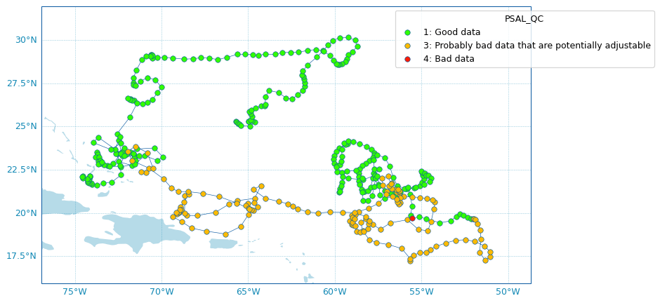

.. currentmodule:: argopy

What's New
==========

|release date| |PyPI| |Conda|

|pypi dwn| |conda dwn|

Coming up on the next release
-----------------------------

**Features and front-end API**

- **Our internal Argo index store is promoted as a frontend feature**. The :class:`IndexFetcher` is a user-friendly **fetcher** built on top of our internal Argo index file store. But if you are familiar with Argo index files and/or cares about performances, you may be interested in using directly the Argo index **store**. We thus decided to promote this internal feature as a frontend class :class:`ArgoIndex`. See :ref:`Store: Low-level Argo Index access`.

- **argopy now provides a specific xarray engine to properly read Argo netcdf files**. Using ``engine='argo'`` in :func:`xarray.open_dataset`, all variables will properly be casted, i.e. returned with their expected data types, which is not the case otherwise. This works with *ALL* Argo netcdf file types (as listed in the `Reference table R01 <http://vocab.nerc.ac.uk/collection/R01/current/>`_).  (:pr:`208`) by `G. Maze <http://www.github.com/gmaze>`_

.. code-block:: python

    import xarray as xr
    ds = xr.open_dataset("dac/aoml/1901393/1901393_prof.nc", engine='argo')

- **argopy now provides authenticated access to the Argo reference database for DMQC**. Using user/password new **argopy** options, it is now possible to fetch the `Argo CTD reference database <http://www.argodatamgt.org/DMQC/Reference-data-base/Latest-Argo-Reference-DB>`_, with the :class:`CTDRefDataFetcher` class. (:pr:`256`) by `G. Maze <http://www.github.com/gmaze>`_

.. code-block:: python

    from argopy import CTDRefDataFetcher

    with argopy.set_options(user="john_doe", password="***"):
        f = CTDRefDataFetcher(box=[15, 30, -70, -60, 0, 5000.0])
        ds = f.to_xarray()

- New option to control the expiration time of cache file ``cache_expiration``. 

**Internals**

- **Index store can now export search results to standard Argo index file format**. See all details in :ref:`Store: Low-level Argo Index access`. (:pr:`260`) by `G. Maze <http://www.github.com/gmaze>`_

.. code-block:: python

    from argopy.stores import indexstore_pd as indexstore
    # or:
    # from argopy.stores import indexstore_pa as indexstore

    idx = indexstore().search_wmo(3902131)  # Perform any search
    idx.to_indexfile('short_index.txt')  # export search results as standard Argo index csv file

- **Index store can now load/search the Argo Bio and Synthetic profile index files**. Simply gives the name of the Bio or Synthtetic Profile index file and retrieve the full index. This  store also comes with a new search criteria fro BGC: by parameters. See all details in :ref:`Store: Low-level Argo Index access`.  (:pr:`261`) by `G. Maze <http://www.github.com/gmaze>`_

.. code-block:: python

    from argopy.stores import indexstore_pd as indexstore
    # or:
    # from argopy.stores import indexstore_pa as indexstore

    idx = indexstore(index_file="argo_bio-profile_index.txt").load()
    idx.search_params(['C1PHASE_DOXY', 'DOWNWELLING_PAR'])

- Use a mocked server for all http and GDAC ftp requests in CI tests (:pr:`249`, :pr:`252`, :pr:`255`) by `G. Maze <http://www.github.com/gmaze>`_
- Removed support for minimal dependency requirements and for python 3.7. (:pr:`252`) by `G. Maze <http://www.github.com/gmaze>`_
- Changed License from Apache to `EUPL 1.2 <https://opensource.org/license/eupl-1-2>`_

v0.1.13 (28 Mar. 2023)
----------------------

**Features and front-end API**

- **New utility class to retrieve the Argo deployment plan from the Ocean-OPS api.** This is the utility class :class:`OceanOPSDeployments`. See the new documentation section on :ref:`Deployment Plan` for more. (:pr:`244`) by `G. Maze <http://www.github.com/gmaze>`_

.. code-block:: python

    from argopy import OceanOPSDeployments

    deployment = OceanOPSDeployments()
    deployment = OceanOPSDeployments([-90,0,0,90])
    deployment = OceanOPSDeployments([-90,0,0,90], deployed_only=True) # Remove planification

    df = deployment.to_dataframe()
    deployment.status_code
    fig, ax = deployment.plot_status()

.. image:: _static/scatter_map_deployment_status.png

- **New scatter map utility for easy Argo-related variables plotting.** The new :meth:`argopy.plot.scatter_map` utility function is dedicated to making maps with Argo profiles positions coloured according to specific variables: a scatter map. Profiles colouring is finely tuned for some variables: QC flags, Data Mode and Deployment Status. By default, floats trajectories are always shown, but this can be changed. See the new documentation section on :ref:`Scatter Maps` for more. (:pr:`245`) by `G. Maze <http://www.github.com/gmaze>`_

.. code-block:: python

    from argopy.plot import scatter_map

    fig, ax = scatter_map(ds_or_df,
                          x='LONGITUDE', y='LATITUDE', hue='PSAL_QC',
                          traj_axis='PLATFORM_NUMBER')

- **New Argo colors utility to manage segmented colormaps and pre-defined Argo colors set.** The new :class:`argopy.plot.ArgoColors` utility class aims to easily provide colors for Argo-related variables plot. See the new documentation section on :ref:`Argo colors` for more (:pr:`245`) by `G. Maze <http://www.github.com/gmaze>`_

.. code-block:: python

    from argopy.plot import ArgoColors

    ArgoColors().list_valid_known_colormaps
    ArgoColors().known_colormaps.keys()

    ArgoColors('data_mode')
    ArgoColors('data_mode').cmap
    ArgoColors('data_mode').definition

    ArgoColors('Set2').cmap
    ArgoColors('Spectral', N=25).cmap

**Internals**

- Because of the new :class:`argopy.plot.ArgoColors`, the :class:`argopy.plot.discrete_coloring` utility is deprecated in 0.1.13. Calling it will raise an error after argopy 0.1.14. (:pr:`245`) by `G. Maze <http://www.github.com/gmaze>`_

- New method to check status of web API: now allows for a keyword check rather than a simple url ping. This comes with 2 new utilities functions :meth:`utilities.urlhaskeyword` and :meth:`utilities.isalive`. (:pr:`247`) by `G. Maze <http://www.github.com/gmaze>`_.

- Removed dependency to Scikit-learn LabelEncoder (:pr:`239`) by `G. Maze <http://www.github.com/gmaze>`_

**Breaking changes**

- Data source ``localftp`` is deprecated and removed from **argopy**. It's been replaced by the ``gdac`` data source with the appropriate ``ftp`` option. See :ref:`Data sources`. (:pr:`240`) by `G. Maze <http://www.github.com/gmaze>`_

**Breaking changes with previous versions**

- :class:`argopy.utilities.ArgoNVSReferenceTables` methods ``all_tbl`` and ``all_tbl_name`` are now properties, not methods.

v0.1.12 (16 May 2022)
----------------------

**Internals**

- Update ``erddap`` server from https://www.ifremer.fr/erddap to https://erddap.ifremer.fr/erddap. (:commit:`af5692f9f7b236c5cd62c202252074cccec97c34`) by `G. Maze <http://www.github.com/gmaze>`_

v0.1.11 (13 Apr. 2022)
----------------------

**Features and front-end API**

- **New data source ``gdac`` to retrieve data from a GDAC compliant source**, for DataFetcher and IndexFetcher. You can specify the FTP source with the ``ftp`` fetcher option or with the argopy global option ``ftp``. The FTP source support http, ftp or local files protocols. This fetcher is optimised if pyarrow is available, otherwise pandas dataframe are used. See update on :ref:`Data sources`. (:pr:`157`) by `G. Maze <http://www.github.com/gmaze>`_

.. code-block:: python

    from argopy import IndexFetcher
    from argopy import DataFetcher
    argo = IndexFetcher(src='gdac')
    argo = DataFetcher(src='gdac')
    argo = DataFetcher(src='gdac', ftp="https://data-argo.ifremer.fr")  # Default and fastest !
    argo = DataFetcher(src='gdac', ftp="ftp://ftp.ifremer.fr/ifremer/argo")
    with argopy.set_options(src='gdac', ftp='ftp://usgodae.org/pub/outgoing/argo'):
        argo = DataFetcher()

.. note::

    The new ``gdac`` fetcher uses Argo index to determine which profile files to load. Hence, this fetcher may show poor performances when used with a ``region`` access point. Don't hesitate to check :ref:`Performances` to try to improve performances, otherwise, we recommend to use a webAPI access point (``erddap`` or ``argovis``).

.. warning::

    Since the new ``gdac`` fetcher can use a local copy of the GDAC ftp server, the legacy ``localftp`` fetcher is now deprecated.
    Using it will raise a error up to v0.1.12. It will then be removed in v0.1.13.

- **New dashboard for profiles and new 3rd party dashboards**. Calling on the data fetcher dashboard method will return the Euro-Argo profile page for a single profile. Very useful to look at the data before load. This comes with 2 new utilities functions to get Coriolis ID of profiles (:meth:`utilities.get_coriolis_profile_id`) and to return the list of profile webpages (:meth:`utilities.get_ea_profile_page`). (:pr:`198`) by `G. Maze <http://www.github.com/gmaze>`_.

.. code-block:: python

    from argopy import DataFetcher as ArgoDataFetcher
    ArgoDataFetcher().profile(5904797, 11).dashboard()

.. code-block:: python

    from argopy.utilities import get_coriolis_profile_id, get_ea_profile_page
    get_coriolis_profile_id([6902755, 6902756], [11, 12])
    get_ea_profile_page([6902755, 6902756], [11, 12])

The new profile dashboard can also be accessed with:

.. code-block:: python

    import argopy
    argopy.dashboard(5904797, 11)

We added the Ocean-OPS (former JCOMMOPS) dashboard for all floats and the Argo-BGC dashboard for BGC floats:

.. code-block:: python

    import argopy
    argopy.dashboard(5904797, type='ocean-ops')
    # or
    argopy.dashboard(5904797, 12, type='bgc')

- **New utility function :class:`argopy.utilities.ArgoNVSReferenceTables` to retrieve Argo Reference Tables**. (:commit:`cc8fdbe132874b71b35203053626cc29ae7d19c4`) by `G. Maze <http://www.github.com/gmaze>`_.

.. code-block:: python

    from argopy.utilities import ArgoNVSReferenceTables
    R = ArgoNVSReferenceTables()
    R.all_tbl_name()
    R.tbl(3)
    R.tbl('R09')

**Internals**

- ``gdac`` and ``localftp`` data fetchers can return an index without loading the data. (:pr:`157`) by `G. Maze <http://www.github.com/gmaze>`_

.. code-block:: python

    from argopy import DataFetcher
    argo = DataFetcher(src='gdac').float(6903076)
    argo.index

- New index store design. A new index store is used by data and index ``gdac`` fetchers to handle access and search in Argo index csv files. It uses pyarrow table if available or pandas dataframe otherwise. More details at :ref:`Argo index store`. Directly using this index store is not recommended but provides better performances for expert users interested in Argo sampling analysis.

.. code-block:: python

    from argopy.stores.argo_index_pa import indexstore_pyarrow as indexstore
    idx = indexstore(host="https://data-argo.ifremer.fr", index_file="ar_index_global_prof.txt")  # Default
    idx.load()
    idx.search_lat_lon_tim([-60, -55, 40., 45., '2007-08-01', '2007-09-01'])
    idx.N_MATCH  # Return number of search results
    idx.to_dataframe()  # Convert search results to a dataframe

- Refactoring of CI tests to use more fixtures and pytest parametrize. (:pr:`157`) by `G. Maze <http://www.github.com/gmaze>`_

- Fix bug in erddap fata fetcher that was causing a `profile` request to do not account for cycle numbers. (:commit:`301e557fdec1f2d536841464b383edc3a4c4a62d`) by `G. Maze <http://www.github.com/gmaze>`_.

**Breaking changes**

- Index fetcher for local FTP no longer support the option ``index_file``. The name of the file index is internally determined using the dataset requested: ``ar_index_global_prof.txt`` for ``ds='phy'`` and ``argo_synthetic-profile_index.txt`` for ``ds='bgc'``. Using this option will raise a deprecation warning up to v0.1.12 and will then raise an error. (:pr:`157`) by `G. Maze <http://www.github.com/gmaze>`_

- Complete refactoring of the ``argopy.plotters`` module into ``argopy.plot``. (:pr:`198`) by `G. Maze <http://www.github.com/gmaze>`_.

- Remove deprecation warnings for: 'plotters.plot_dac', 'plotters.plot_profilerType'. These now raise an error.

v0.1.10 (4 Mar. 2022)
---------------------

**Internals**

- Update and clean up requirements. Remove upper bound on all dependencies (:pr:`182`) by `R. Abernathey <http://www.github.com/rabernat>`_.

v0.1.9 (19 Jan. 2022)
---------------------

**Features and front-end API**

- **New method to preprocess data for OWC software**. This method can preprocessed Argo data and possibly create float_source/<WMO>.mat files to be used as inputs for OWC implementations in `Matlab <https://github.com/ArgoDMQC/matlab_owc>`_ and `Python <https://github.com/euroargodev/argodmqc_owc>`_. See the :ref:`Salinity calibration` documentation page for more. (:pr:`142`) by `G. Maze <http://www.github.com/gmaze>`_.

.. code-block:: python

    from argopy import DataFetcher as ArgoDataFetcher
    ds = ArgoDataFetcher(mode='expert').float(6902766).load().data
    ds.argo.create_float_source("float_source")
    ds.argo.create_float_source("float_source", force='raw')
    ds_source = ds.argo.create_float_source()

.. currentmodule:: xarray

This new method comes with others methods and improvements:

    - A new :meth:`Dataset.argo.filter_scalib_pres` method to filter variables according to OWC salinity calibration software requirements,
    - A new :meth:`Dataset.argo.groupby_pressure_bins` method to subsample a dataset down to one value by pressure bins (a perfect alternative to interpolation on standard depth levels to precisely avoid interpolation...), see :ref:`Pressure levels: Group-by bins` for more help,
    - An improved :meth:`Dataset.argo.filter_qc` method to select which fields to consider (new option ``QC_fields``),
    - Add conductivity (``CNDC``) to the possible output of the ``TEOS10`` method.

.. currentmodule:: argopy

- **New dataset properties** accessible from the `argo` xarray accessor: ``N_POINTS``, ``N_LEVELS``, ``N_PROF``. Note that depending on the format of the dataset (a collection of points or of profiles) these values do or do not take into account NaN. These information are also visible by a simple print of the accessor. (:pr:`142`) by `G. Maze <http://www.github.com/gmaze>`_.

.. code-block:: python

    from argopy import DataFetcher as ArgoDataFetcher
    ds = ArgoDataFetcher(mode='expert').float(6902766).load().data
    ds.argo.N_POINTS
    ds.argo.N_LEVELS
    ds.argo.N_PROF
    ds.argo

- **New plotter function** :meth:`argopy.plotters.open_sat_altim_report` to insert the CLS Satellite Altimeter Report figure in a notebook cell. (:pr:`159`) by `G. Maze <http://www.github.com/gmaze>`_.

.. code-block:: python

    from argopy.plotters import open_sat_altim_report
    open_sat_altim_report(6902766)
    open_sat_altim_report([6902766, 6902772, 6902914])
    open_sat_altim_report([6902766, 6902772, 6902914], embed='dropdown')  # Default
    open_sat_altim_report([6902766, 6902772, 6902914], embed='slide')
    open_sat_altim_report([6902766, 6902772, 6902914], embed='list')
    open_sat_altim_report([6902766, 6902772, 6902914], embed=None)

    from argopy import DataFetcher
    from argopy import IndexFetcher
    DataFetcher().float([6902745, 6902746]).plot('qc_altimetry')
    IndexFetcher().float([6902745, 6902746]).plot('qc_altimetry')

- **New utility method to retrieve topography**. The :class:`argopy.TopoFetcher` will load the `GEBCO topography <https://coastwatch.pfeg.noaa.gov/erddap/griddap/GEBCO_2020.html>`_ for a given region. (:pr:`150`) by `G. Maze <http://www.github.com/gmaze>`_.

.. code-block:: python

    from argopy import TopoFetcher
    box = [-75, -45, 20, 30]
    ds = TopoFetcher(box).to_xarray()
    ds = TopoFetcher(box, ds='gebco', stride=[10, 10], cache=True).to_xarray()

For convenience we also added a new property to the data fetcher that return the domain covered by the dataset.

.. code-block:: python

    loader = ArgoDataFetcher().float(2901623)
    loader.domain  # Returns [89.093, 96.036, -0.278, 4.16, 15.0, 2026.0, numpy.datetime64('2010-05-14T03:35:00.000000000'),  numpy.datetime64('2013-01-01T01:45:00.000000000')]

- Update the documentation with a new section about :ref:`data_qc`.

**Internals**

- Uses a new API endpoint for the ``argovis`` data source when fetching a ``region``. `More on this issue here <https://github.com/donatagiglio/Argovis/issues/3>`_. (:pr:`158`) by `G. Maze <http://www.github.com/gmaze>`_.

- Update documentation theme, and pages now use the `xarray accessor sphinx extension <https://github.com/xarray-contrib/sphinx-autosummary-accessors>`_. (:pr:`104`) by `G. Maze <http://www.github.com/gmaze>`_.

- Update Binder links to work without the deprecated Pangeo-Binder service. (:pr:`164`) by `G. Maze <http://www.github.com/gmaze>`_.

v0.1.8 (2 Nov. 2021)
---------------------

**Features and front-end API**

- Improve plotting functions. All functions are now available for both the index and data fetchers. See the :ref:`data_viz` page for more details. Reduced plotting dependencies to `Matplotlib <https://matplotlib.org/>`_ only. **Argopy** will use `Seaborn <seaborn.pydata.org/>`_ and/or `Cartopy <https://scitools.org.uk/cartopy>`_ if available. (:pr:`56`) by `G. Maze <http://www.github.com/gmaze>`_.

.. code-block:: python

    from argopy import IndexFetcher as ArgoIndexFetcher
    from argopy import DataFetcher as ArgoDataFetcher
    obj = ArgoIndexFetcher().float([6902766, 6902772, 6902914, 6902746])
    # OR
    obj = ArgoDataFetcher().float([6902766, 6902772, 6902914, 6902746])

    fig, ax = obj.plot()
    fig, ax = obj.plot('trajectory')
    fig, ax = obj.plot('trajectory', style='white', palette='Set1', figsize=(10,6))
    fig, ax = obj.plot('dac')
    fig, ax = obj.plot('institution')
    fig, ax = obj.plot('profiler')

- New methods and properties for data and index fetchers. (:pr:`56`) by `G. Maze <http://www.github.com/gmaze>`_. The :meth:`argopy.DataFetcher.load` and :meth:`argopy.IndexFetcher.load` methods internally call on the `to_xarray()` methods and store results in the fetcher instance. The :meth:`argopy.DataFetcher.to_xarray` will trigger a fetch on every call, while the :meth:`argopy.DataFetcher.load` will not.

.. code-block:: python

    from argopy import DataFetcher as ArgoDataFetcher
    loader = ArgoDataFetcher().float([6902766, 6902772, 6902914, 6902746])
    loader.load()
    loader.data
    loader.index
    loader.to_index()

.. code-block:: python

    from argopy import IndexFetcher as ArgoIndexFetcher
    indexer = ArgoIndexFetcher().float([6902766, 6902772])
    indexer.load()
    indexer.index

- Add optional speed of sound computation to xarray accessor teos10 method. (:pr:`90`) by `G. Maze <http://www.github.com/gmaze>`_.

- Code spell fixes (:pr:`89`) by `K. Schwehr <https://github.com/schwehr>`_.

**Internals**

- Check validity of access points options (WMO and box) in the facade, no checks at the fetcher level. (:pr:`92`) by `G. Maze <http://www.github.com/gmaze>`_.

- More general options. Fix :issue:`91`. (:pr:`102`) by `G. Maze <http://www.github.com/gmaze>`_.

    - ``trust_env`` to allow for local environment variables to be used by fsspec to connect to the internet. Useful for those using a proxy.

- Documentation on `Read The Docs` now uses a pip environment and get rid of memory eager conda. (:pr:`103`) by `G. Maze <http://www.github.com/gmaze>`_.

- :class:`xarray.Dataset` argopy accessor ``argo`` has a clean documentation.

**Breaking changes with previous versions**

- Drop support for python 3.6 and older. Lock range of dependencies version support.

- In the plotters module, the ``plot_dac`` and ``plot_profilerType`` functions have been replaced by ``bar_plot``. (:pr:`56`) by `G. Maze <http://www.github.com/gmaze>`_.

**Internals**

- Internal logging available and upgrade dependencies version support (:pr:`56`) by `G. Maze <http://www.github.com/gmaze>`_. To see internal logs, you can set-up your application like this:

.. code-block:: python

    import logging
    DEBUGFORMATTER = '%(asctime)s [%(levelname)s] [%(name)s] %(filename)s:%(lineno)d: %(message)s'
    logging.basicConfig(
        level=logging.DEBUG,
        format=DEBUGFORMATTER,
        datefmt='%m/%d/%Y %I:%M:%S %p',
        handlers=[logging.FileHandler("argopy.log", mode='w')]
    )

v0.1.7 (4 Jan. 2021)
-----------------------

Long due release !

**Features and front-end API**

- Live monitor for the status (availability) of data sources. See documentation page on :ref:`api-status`. (:pr:`36`) by `G. Maze <http://www.github.com/gmaze>`_.

.. code-block:: python

    import argopy
    argopy.status()
    # or
    argopy.status(refresh=15)

.. image:: _static/status_monitor.png
  :width: 350

- Optimise large data fetching with parallelization, for all data fetchers (erddap, localftp and argovis). See documentation page on :ref:`parallel`. Two parallel methods are available: multi-threading or multi-processing. (:pr:`28`) by `G. Maze <http://www.github.com/gmaze>`_.

.. code-block:: python

    from argopy import DataFetcher as ArgoDataFetcher
    loader = ArgoDataFetcher(parallel=True)
    loader.float([6902766, 6902772, 6902914, 6902746]).to_xarray()
    loader.region([-85,-45,10.,20.,0,1000.,'2012-01','2012-02']).to_xarray()

**Breaking changes with previous versions**

- In the teos10 xarray accessor, the ``standard_name`` attribute will now be populated using values from the `CF Standard Name table <https://cfconventions.org/Data/cf-standard-names/76/build/cf-standard-name-table.html>`_ if one exists.
  The previous values of ``standard_name`` have been moved to the ``long_name`` attribute.
  (:pr:`74`) by `A. Barna <https://github.com/docotak>`_.
  
- The unique resource identifier property is now named ``uri`` for all data fetchers, it is always a list of strings.

**Internals**

- New ``open_mfdataset`` and ``open_mfjson`` methods in Argo stores. These can be used to open, pre-process and concatenate a collection of paths both in sequential or parallel order. (:pr:`28`) by `G. Maze <http://www.github.com/gmaze>`_.

- Unit testing is now done on a controlled conda environment. This allows to more easily identify errors coming from development vs errors due to dependencies update. (:pr:`65`) by `G. Maze <http://www.github.com/gmaze>`_.

v0.1.6 (31 Aug. 2020)
---------------------

- **JOSS paper published**. You can now cite argopy with a clean reference. (:pr:`30`) by `G. Maze <http://www.github.com/gmaze>`_ and `K. Balem <http://www.github.com/quai20>`_.

Maze G. and Balem K. (2020). argopy: A Python library for Argo ocean data analysis. *Journal of Open Source Software*, 5(52), 2425 doi: `10.21105/joss.02425 <http://dx.doi.org/10.21105/joss.02425>`_.

v0.1.5 (10 July 2020)
---------------------

**Features and front-end API**

- A new data source with the **argovis** data fetcher, all access points available (:pr:`24`). By `T. Tucker <https://github.com/tylertucker202>`_ and `G. Maze <http://www.github.com/gmaze>`_.

.. code-block:: python

    from argopy import DataFetcher as ArgoDataFetcher
    loader = ArgoDataFetcher(src='argovis')
    loader.float(6902746).to_xarray()
    loader.profile(6902746, 12).to_xarray()
    loader.region([-85,-45,10.,20.,0,1000.,'2012-01','2012-02']).to_xarray()

- Easily compute `TEOS-10 <http://teos-10.org/>`_ variables with new argo accessor function **teos10**. This needs `gsw <https://github.com/TEOS-10/GSW-Python>`_ to be installed. (:pr:`37`) By `G. Maze <http://www.github.com/gmaze>`_.

.. code-block:: python

    from argopy import DataFetcher as ArgoDataFetcher
    ds = ArgoDataFetcher().region([-85,-45,10.,20.,0,1000.,'2012-01','2012-02']).to_xarray()
    ds = ds.argo.teos10()
    ds = ds.argo.teos10(['PV'])
    ds_teos10 = ds.argo.teos10(['SA', 'CT'], inplace=False)

- **argopy** can now be installed with conda (:pr:`29`, :pr:`31`, :pr:`32`). By `F. Fernandes <https://github.com/ocefpaf>`_.

.. code-block:: text

    conda install -c conda-forge argopy

**Breaking changes with previous versions**

- The ``local_ftp`` option of the ``localftp`` data source must now points to the folder where the ``dac`` directory is found. This breaks compatibility with rsynced local FTP copy because rsync does not give a ``dac`` folder (e.g. :issue:`33`). An instructive error message is raised to notify users if any of the DAC name is found at the n-1 path level. (:pr:`34`).

**Internals**

- Implement a webAPI availability check in unit testing. This allows for more robust ``erddap`` and ``argovis`` tests that are not only based on internet connectivity only. (:commit:`5a46a39a3368431c6652608ee7241888802f334f`).

v0.1.4 (24 June 2020)
---------------------

**Features and front-end API**

- Standard levels interpolation method available in **standard** user mode (:pr:`23`). By `K. Balem <http://www.github.com/quai20>`_.

.. code-block:: python

    ds = ArgoDataFetcher().region([-85,-45,10.,20.,0,1000.,'2012-01','2012-12']).to_xarray()
    ds = ds.argo.point2profile()
    ds_interp = ds.argo.interp_std_levels(np.arange(0,900,50))

- Insert in a Jupyter notebook cell the `Euro-Argo fleet monitoring <https://fleetmonitoring.euro-argo.eu>`_ dashboard page, possibly for a specific float (:pr:`20`). By `G. Maze <http://www.github.com/gmaze>`_.

.. code-block:: python

    import argopy
    argopy.dashboard()
    # or
    argopy.dashboard(wmo=6902746)

- The ``localftp`` index and data fetcher now have the ``region`` and ``profile`` access points available (:pr:`25`). By `G. Maze <http://www.github.com/gmaze>`_.

**Breaking changes with previous versions**

[None]

**Internals**

- Now uses `fsspec <https://filesystem-spec.readthedocs.io>`_ as file system for caching as well as accessing local and remote files (:pr:`19`). This closes issues :issue:`12`, :issue:`15` and :issue:`17`. **argopy** fetchers must now use (or implement if necessary) one of the internal file systems available in the new module ``argopy.stores``. By `G. Maze <http://www.github.com/gmaze>`_.

- Erddap fetcher now uses netcdf format to retrieve data (:pr:`19`).

v0.1.3 (15 May 2020)
--------------------

**Features and front-end API**

- New ``index`` fetcher to explore and work with meta-data (:pr:`6`). By `K. Balem <http://www.github.com/quai20>`_.

.. code-block:: python

    from argopy import IndexFetcher as ArgoIndexFetcher
    idx = ArgoIndexFetcher().float(6902746)
    idx.to_dataframe()
    idx.plot('trajectory')

The ``index`` fetcher can manage caching and works with both Erddap and localftp data sources. It is basically the same as the data fetcher, but do not load measurements, only meta-data. This can be very useful when looking for regional sampling or trajectories.

.. tip::

  **Performance**: we recommend to use the ``localftp`` data source when working this ``index`` fetcher because the ``erddap`` data source currently suffers from poor performances. This is linked to :issue:`16` and is being addressed by Ifremer.

The ``index`` fetcher comes with basic plotting functionalities with the :func:`argopy.IndexFetcher.plot` method to rapidly visualise measurement distributions by DAC, latitude/longitude and floats type.

.. warning::

  The design of plotting and visualisation features in ``argopy`` is constantly evolving, so this may change in future releases.

- Real documentation written and published (:pr:`13`). By `G. Maze <http://www.github.com/gmaze>`_.

- The :class:`argopy.DataFetcher` now has a :func:`argopy.DataFetcher.to_dataframe` method to return a :class:`pandas.DataFrame`.

- Started a draft for `JOSS <https://joss.theoj.org/>`_ (:commit:`1e37df44073261df2af486a2da014be8f59bc4cd`).

- New utilities function: :func:`argopy.utilities.open_etopo1`, :func:`argopy.show_versions`.

**Breaking changes with previous versions**

- The ``backend`` option in data fetchers and the global option ``datasrc`` have been renamed to ``src``. This makes the code more coherent (:commit:`ec6b32e94b78b2510985cfda49025c10ba97ecab`).

**Code management**

- Add Pypi automatic release publishing with github actions (:commit:`c4307885622709881e34909fd42e43f16a6a7cf4`)

- Remove Travis CI, fully adopt Github actions (:commit:`c4557425718f700b4aee760292b20b0642181dc6`)

- Improved unit testing (:commit:`e9555d1e6e90d3d1e75183cec0c4e14f7f19c17c`, :commit:`4b60ede844e37df86b32e4e2a2008335472a8cc1`, :commit:`34abf4913cb8bec027f88301c5504ebe594b3eae`)

v0.1.2 (15 May 2020)
--------------------

We didn't like this one this morning, so we move one to the next one !

v0.1.1 (3 Apr. 2020)
---------------------

**Features and front-end API**

- Added new data fetcher backend ``localftp`` in DataFetcher (:commit:`c5f7cb6f59d1f64a35dad28f386c9b1166883b81`):

.. code-block:: python

    from argopy import DataFetcher as ArgoDataFetcher
    argo_loader = ArgoDataFetcher(backend='localftp', path_ftp='/data/Argo/ftp_copy')
    argo_loader.float(6902746).to_xarray()

- Introduced global ``OPTIONS`` to set values for: cache folder, dataset (eg:`phy` or `bgc`), local ftp path, data fetcher (`erddap` or `localftp`) and user level (`standard` or `expert`). Can be used in context `with` (:commit:`83ccfb5110aa6abc6e972b92ba787a3e1228e33b`):

.. code-block:: python

    with argopy.set_options(mode='expert', datasrc='erddap'):
        ds = argopy.DataFetcher().float(3901530).to_xarray()

- Added a ``argopy.tutorial`` module to be able to load sample data for documentation and unit testing (:commit:`4af09b55a019a57fc3f1909a70e463f26f8863a1`):

.. code-block:: python

    ftproot, flist = argopy.tutorial.open_dataset('localftp')
    txtfile = argopy.tutorial.open_dataset('weekly_index_prof')

- Improved xarray *argo* accessor. Added methods for casting data types, to filter variables according to data mode, to filter variables according to quality flags. Useful methods to transform collection of points into collection of profiles, and vice versa (:commit:`14cda55f437f53cb19274324dce3e81f64bbb08f`):

.. code-block:: python

    ds = argopy.DataFetcher().float(3901530).to_xarray() # get a collection of points
    dsprof = ds.argo.point2profile() # transform to profiles
    ds = dsprof.argo.profile2point() # transform to points

- Changed License from MIT to Apache (:commit:`25f90c9cf6eab15c249c233c1677faaf5dc403c4`)

**Internal machinery**

- Add ``__all__`` to control ``from argopy import *`` (:commit:`83ccfb5110aa6abc6e972b92ba787a3e1228e33b`)

- All data fetchers inherit from class ``ArgoDataFetcherProto`` in ``proto.py`` (:commit:`44f45a5657f0ef7d06583df7142db61f82d1482e`)

- Data fetchers use default options from global OPTIONS

- In Erddap fetcher: methods to cast data type, to filter by data mode and by QC flags are now delegated to the xarray argo accessor methods.

- Data fetchers methods to filter variables according to user mode are using variable lists defined in utilities.

- ``argopy.utilities`` augmented with listing functions of: backends, standard variables and multiprofile files variables.

- Introduce custom errors in errors.py (:commit:`2563c9f0328121279a9b43220d197a622d1db12f`)

- Front-end API ArgoDataFetcher uses a more general way of auto-discovering fetcher backend and their access points. Turned of the ``deployments`` access point, waiting for the index fetcher to do that.

- Improved xarray *argo* accessor. More reliable ``point2profile`` and data type casting with ``cast_type``

**Code management**

- Add CI with github actions (:commit:`ecbf9bacded7747f27c698e90377e5ee40fc8999`)

- Contribution guideline for data fetchers (:commit:`b332495fce7f1650ae5bb8ec3148ade4c4f72702`)

- Improve unit testing (all along commits)

- Introduce code coverage (:commit:`b490ab56581d1ce0f58b44df532e35e87ecf04ff`)

- Added explicit support for python 3.6 , 3.7 and 3.8 (:commit:`58f60fe88a3aa85357754cafab8d89a4d948f35a`)

v0.1.0 (17 Mar. 2020)
---------------------

- Initial release.

- Erddap data fetcher

.. |pypi dwn| image:: https://img.shields.io/pypi/dm/argopy?label=Pypi%20downloads
   :target: //pypi.org/project/argopy/
.. |conda dwn| image:: https://img.shields.io/conda/dn/conda-forge/argopy?label=Conda%20downloads
   :target: //anaconda.org/conda-forge/argopy
.. |PyPI| image:: https://img.shields.io/pypi/v/argopy
   :target: //pypi.org/project/argopy/
.. |Conda| image:: https://anaconda.org/conda-forge/argopy/badges/version.svg
   :target: //anaconda.org/conda-forge/argopy
.. |release date| image:: https://img.shields.io/github/release-date/euroargodev/argopy?display_date=published_at
   :target: //github.com/euroargodev/argopy/releases
   
